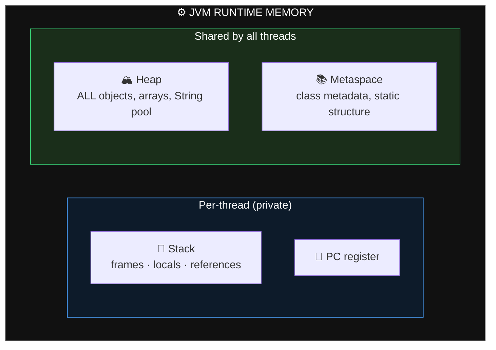
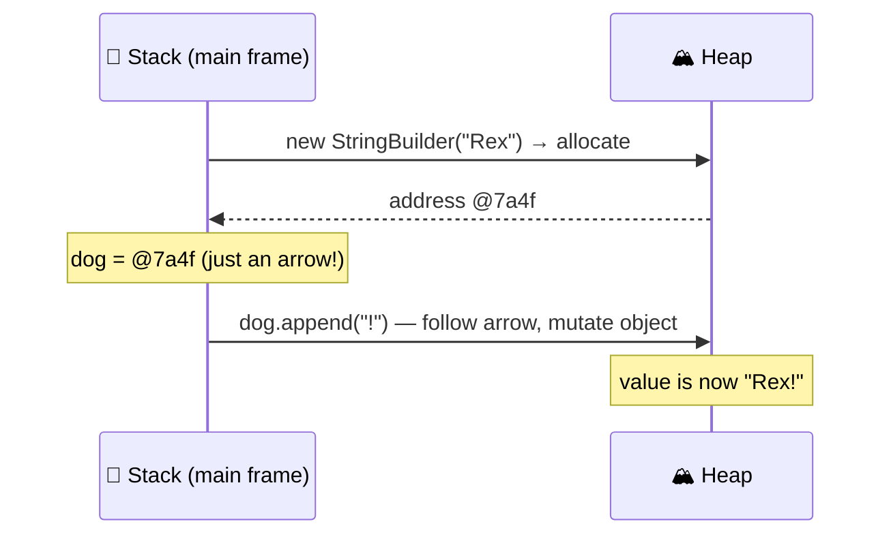
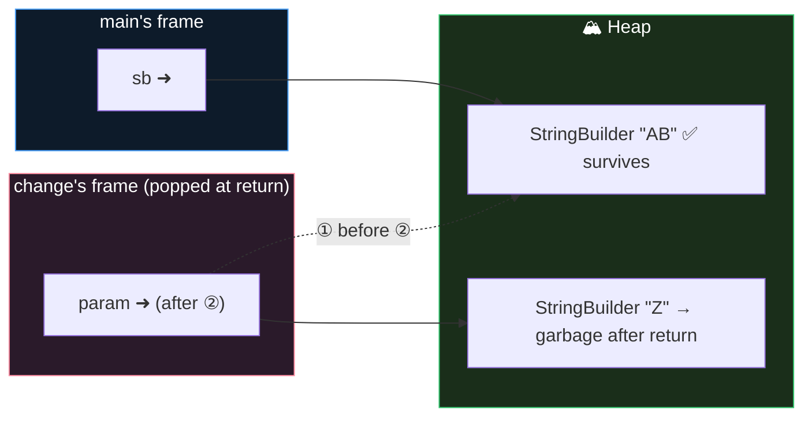
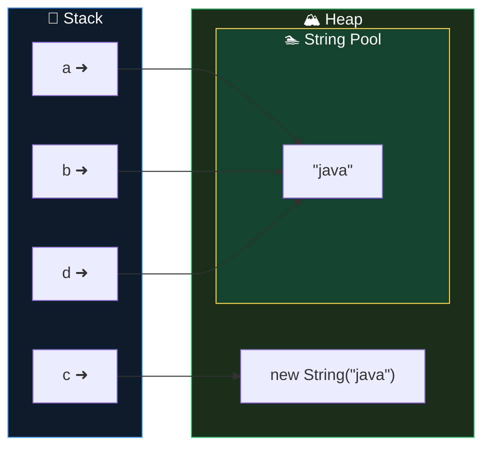
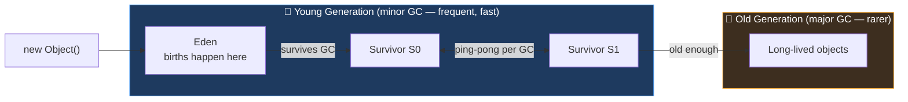
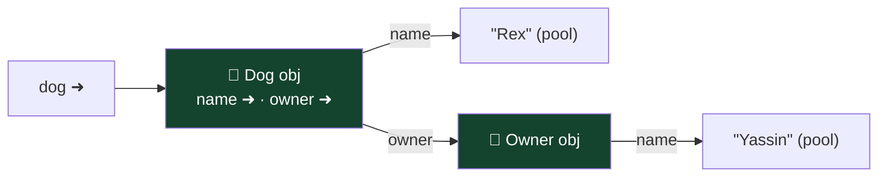
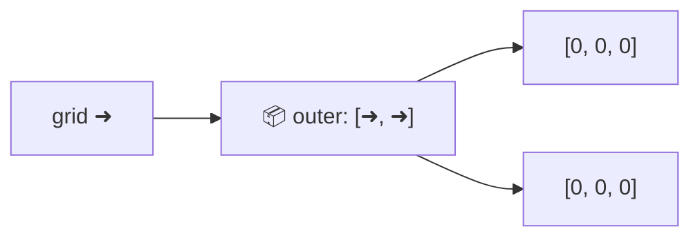
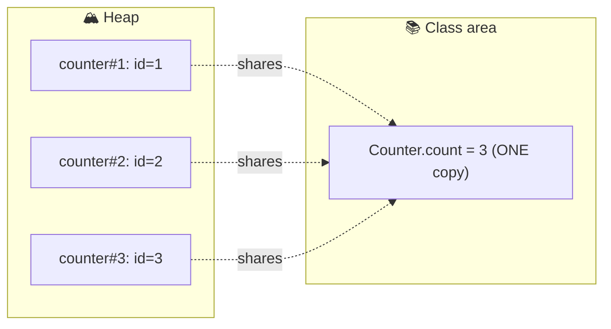

# 🧠 Java Memory Explained — Stack, Heap, String Pool & GC (with diagrams)

> **by Yassin Ghariani — JavaBoy ☕** · The mental model that makes 40% of exam traps trivial.
> All diagrams render on GitHub. Animated version: [`interactive/memory-visualizer.html`](../interactive/memory-visualizer.html).

---

## 1. The JVM's memory map



| Area | Holds | Lifetime | Error when full |
|------|-------|----------|-----------------|
| Stack | frames: locals, params, references | until method returns | `StackOverflowError` (deep/infinite recursion) |
| Heap | every object & array | until unreachable + GC'd | `OutOfMemoryError` |
| Metaspace | class definitions, statics structure | until class unloaded | `OutOfMemoryError: Metaspace` |

> ⚠️ Trap: **references live on the stack (if local), the objects they point to ALWAYS live on the heap.** A `static` field lives with its class; the object it references is still heap.

---

## 2. Object creation, step by step

```java
var dog = new StringBuilder("Rex");
```

1. JVM allocates space on the **heap** for the object.
2. Fields are set to defaults, then the constructor runs.
3. The heap **address** is returned and stored in the stack variable `dog`.



---

## 3. Pass-by-value: the definitive proof 🔬

Java copies the **value of the variable** into the method's frame. For references, that value **is the arrow** — so:

- the method **CAN** mutate the object (both arrows reach it),
- the method **CANNOT** re-point the caller's variable.

```java
void main() {
    var sb = new StringBuilder("A");
    change(sb);
    IO.println(sb);   // prints "AB" — NOT "Z"
}
void change(StringBuilder param) {
    param.append("B");                 // ① mutates the SHARED object ✅
    param = new StringBuilder("Z");    // ② re-points ONLY the local copy ❌
}
```



> 🎯 **Exam rule:** reassigning a parameter never affects the caller. Mutating through a parameter always does.

---

## 4. The String Pool 🔤 (top-3 exam trap)

String **literals** are stored once in a special heap region — the **pool** — and shared. `new String(...)` forces a *separate* heap object.

```java
String a = "java";
String b = "java";            // same pooled object
String c = new String("java"); // NEW object outside the pool
String d = c.intern();         // arrow back into the pool

a == b        // true  (same arrow)
a == c        // false (different objects)
a.equals(c)   // true  (same characters)
a == d        // true
```



Compile-time constant folding joins the pool too:

```java
String e = "ja" + "va";     // constant expression → pooled → e == a is true
String f = getJa() + "va";  // runtime concat → NEW object → f == a is false
```

**Immutability:** a String can never change; every "modifying" method returns a *new* object.

```java
String s = "hello";
s.toUpperCase();      // result thrown away!
IO.println(s);        // hello  ⚠️
```

---

## 5. Wrapper cache 📦 (Integer −128…127)

Autoboxing small ints reuses cached objects — same pool idea:

```java
Integer i1 = 127, i2 = 127;   // i1 == i2 → true  (cache hit)
Integer j1 = 128, j2 = 128;   // j1 == j2 → false (two objects)
```

> 🎯 Rule: **compare objects with `equals()`, always.** `==` on wrappers is a trap generator.

---

## 6. Garbage Collection 🗑️ — generational picture

Most objects die young → the heap is split by *age*:



An object is **eligible** for GC when unreachable from any live thread's stack / static fields:

```java
var a = new Thing();
var b = a;
a = null;      // NOT eligible — b still points to it
b = null;      // NOW eligible
```

⚠️ **Islands of isolation:** two objects pointing at each other but reachable from nowhere → both eligible. Reachability, not reference-count, is what matters.

> Exam-relevant facts: you can *request* GC (`System.gc()`) but never force it; `finalize()` is deprecated for removal — never rely on it.

---

## 7. Memory view of core constructs

### Objects with fields (composition)
```java
record Owner(String name) {}
class Dog { String name; Owner owner; }
```

Objects never contain other objects — only **arrows** to them.

### 2-D arrays = arrays of arrows
```java
int[][] grid = new int[2][3];
```

Rows are independent objects → jagged arrays (`new int[2][]`) are legal.

### `final` = the ARROW is frozen, not the object
```java
final var list = new ArrayList<Integer>();
list.add(1);        // ✅ mutating the heap object is fine
list = new ArrayList<>(); // ❌ compile error — can't re-point the arrow
```

### Static vs instance

One `static` copy per class; one instance-field copy per object. (Exam: you *can* — but shouldn't — call `instance.staticMember`.)

---

## 8. Memory ↔ exam-trap cheat table

| Trap on the exam | Memory truth behind it | Module |
|---|---|---|
| `s.concat("x")` "does nothing" | Strings immutable; result must be assigned | 01 |
| `==` true for `"a"+"b"` vs `"ab"` | constant folding → pool | 01 |
| `Integer 127 ==` true, `128` false | wrapper cache | 01 |
| method "changes" my variable / doesn't | pass-by-value of the arrow | 03 |
| StringBuilder chaining mutates one object | single heap object, `this` returned | 01 |
| array copy changes both | copied arrow, one array | 06 |
| `final` list can still `add` | final freezes arrow only | 03 |
| deep recursion crash | stack frames exhausted → StackOverflowError | 05 |
| islands of isolation Q | reachability decides GC | this doc |
| shallow copy of records | components are arrows too | 04 |

**Now open the animation** → [`interactive/memory-visualizer.html`](../interactive/memory-visualizer.html) 🎬

— *Yassin Ghariani, JavaBoy* ☕
