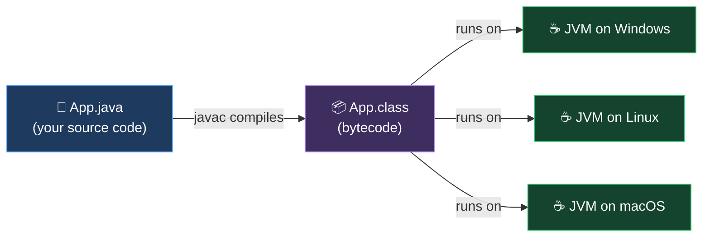
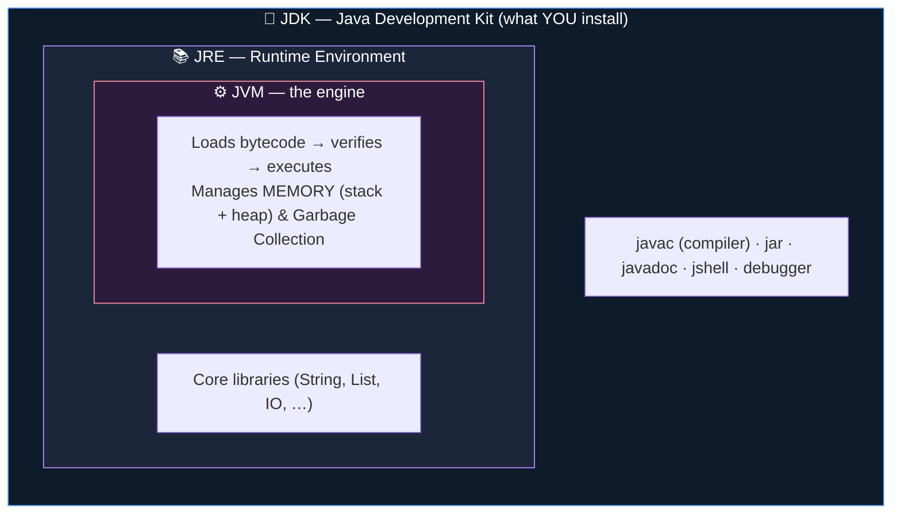
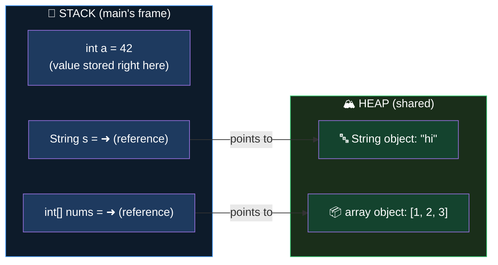
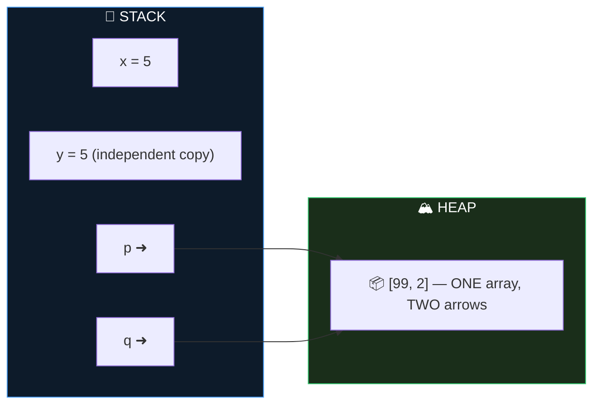
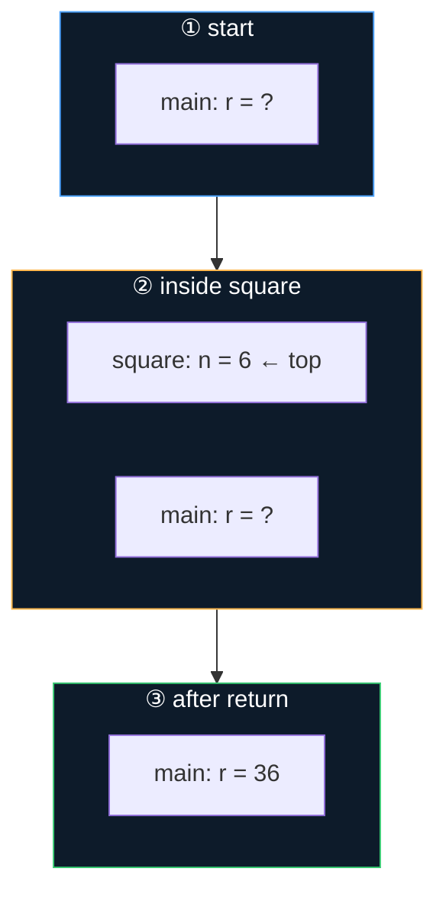

# 🐣 Module 00 — Zero to Java (Start Here If You've NEVER Coded Java)

> **by Yassin Ghariani — JavaBoy ☕** · Read time: ~45 min · No prior knowledge required.
>
> This module exists so that *anyone* — even someone who has never written a line of code — can use this repo. Everything later builds on the mental pictures you form HERE. Diagrams render automatically on GitHub (they're Mermaid). For the *animated* version, open [`interactive/memory-visualizer.html`](../../interactive/memory-visualizer.html) in your browser.

---

## 0.1 What is Java, really?

Java is a language you write in a `.java` text file. A tool called the **compiler** (`javac`) translates it into **bytecode** (a `.class` file) — a universal instruction format. Then the **JVM** (Java Virtual Machine) runs that bytecode on any operating system. That's the famous *"write once, run anywhere."*



### JDK vs JRE vs JVM (nested boxes — memorize this picture)



> 🧠 **Memory hook:** JDK ⊃ JRE ⊃ JVM — "**D**evelopers need everything, **R**unners need libraries, the **V**M is the engine."

---

## 0.2 Your first program (the Java 25 way — it's tiny now)

Create a file `Hello.java` containing **only** this:

```java
void main() {
    IO.println("Hello, I'm learning Java with JavaBoy!");
}
```

Run it (no separate compile step needed for single files):

```bash
java Hello.java
```

That's a **compact source file** (new in Java 25): no class declaration, no `public static void main(String[] args)`, and `IO.println` works without imports. You'll still learn the classic form in Module 03 — the exam tests both:

```java
public class Hello {
    public static void main(String[] args) {
        System.out.println("Hello, classic Java!");
    }
}
```

---

## 0.3 Variables — labeled boxes

A variable is a named box holding a value. Every box has a **type** that says what fits inside.

```java
int age = 25;          // whole number
double price = 9.99;   // decimal number
boolean fun = true;    // true/false
char grade = 'A';      // ONE character, single quotes
String name = "Yassin"; // text — note: String is NOT a primitive!
```

The 8 **primitive** types (simple boxes holding the value *itself*):

| Type | Holds | Size | Example |
|------|-------|------|---------|
| `byte` | tiny int (−128…127) | 8-bit | `byte b = 100;` |
| `short` | small int | 16-bit | `short s = 30_000;` |
| `int` | int (default) | 32-bit | `int i = 2_000_000;` |
| `long` | big int | 64-bit | `long l = 9_000_000_000L;` |
| `float` | decimal | 32-bit | `float f = 1.5f;` |
| `double` | decimal (default) | 64-bit | `double d = 1.5;` |
| `char` | one character | 16-bit | `char c = 'J';` |
| `boolean` | true/false | JVM-dependent | `boolean ok = true;` |

Everything else (`String`, `List`, your own classes…) is a **reference type** — and that difference is the single most important idea in Java memory. Next section. 👇

---

## 0.4 THE BIG PICTURE: Stack vs Heap 🧠

When your program runs, the JVM gives it two main memory areas:

- **The Stack** 🥞 — one per thread. Holds *method calls* (frames) and *local variables*. Fast, small, automatic: when a method returns, its frame vanishes.
- **The Heap** 🏔️ — one shared pool. Holds *objects* (everything created with `new`, plus strings, arrays…). Cleaned by the **Garbage Collector**.

**A primitive variable stores its value directly. A reference variable stores an ARROW (address) pointing to an object on the heap.**

```java
int a = 42;
String s = "hi";
int[] nums = {1, 2, 3};
```



### Why this matters IMMEDIATELY: two variables, one object

```java
int x = 5;
int y = x;      // y gets a COPY of 5. Changing y never touches x.

int[] p = {1, 2};
int[] q = p;    // q gets a COPY OF THE ARROW → same array!
q[0] = 99;
System.out.println(p[0]); // 99 😱 — p and q point to the SAME object
```



> ⚠️ **Exam + real-life rule #1:** Java is ALWAYS **pass-by-value**. For references, the *value* being copied is *the arrow itself* — never the object. Full proof with animation: `docs/JAVA-MEMORY-EXPLAINED.md` + the visualizer.

### Method calls = stack frames 🥞

Each method call pushes a **frame**; returning pops it:

```java
void main() {          // frame 1 pushed
    int r = square(6); // frame 2 pushed on top
    IO.println(r);
}
int square(int n) {    // n = 6 (a copy!)
    return n * n;      // frame 2 popped, 36 goes back
}
```



### The Garbage Collector 🗑️

When no arrow points at an object anymore, it becomes **unreachable** — the GC eventually deletes it. You never `free` memory in Java.

```java
String s = new String("temp");
s = null;   // the "temp" object is now garbage → GC will reclaim it
```

---

## 0.5 Reading errors like a pro (beginners' superpower)

| Message | Meaning | Typical fix |
|---------|---------|-------------|
| `cannot find symbol` | typo / missing import / wrong name | check spelling & imports |
| `';' expected` | missing semicolon on the line ABOVE usually | add `;` |
| `incompatible types` | putting a big value in a small box | cast or change type |
| `NullPointerException` | you followed an arrow that points at nothing (`null`) | check for null before using |
| `ArrayIndexOutOfBoundsException` | asked for a box that doesn't exist | valid indexes: `0 … length-1` |

> 💡 Read the FIRST line of a stack trace + the FIRST line mentioning *your* file. Ignore the rest at first.

---

## 0.6 Setup checklist

1. Install **JDK 25**: easiest via [SDKMAN](https://sdkman.io) → `sdk install java 25-open` (or download from adoptium.net / oracle.com).
2. Verify: `java --version` → must say 25.
3. Editor: IntelliJ IDEA Community (recommended) or VS Code + Java extension.
4. Type (never copy-paste!) `src/FirstSteps.java` from this module and run it: `java src/FirstSteps.java`.
5. Open `interactive/memory-visualizer.html` in your browser and step through the animation until the stack/heap picture feels *obvious*.
6. Take `QUIZ.md`. Score ≥ 90%? → go to Module 01. Otherwise re-read and retry tomorrow.

## ✅ You now know
- [ ] What JDK / JRE / JVM are (nested boxes)
- [ ] How code becomes a running program (source → bytecode → JVM)
- [ ] The 8 primitives vs reference types
- [ ] Stack (frames, locals) vs Heap (objects) and what a reference/arrow is
- [ ] Why copying a reference ≠ copying an object
- [ ] What the Garbage Collector does

*Next stop: [Module 01 — Basics & Data Types](../01-basics-and-data-types/NOTES.md)* 🚀
