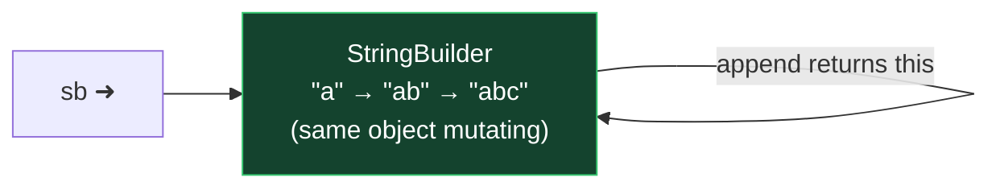

# Module 01 — Basics & Data Types

## 1. Primitives (memorize the table cold)

| Type | Size | Default | Range/Notes |
|------|------|---------|-------|
| byte | 8-bit | 0 | −128 → 127 |
| short | 16-bit | 0 | −32,768 → 32,767 |
| int | 32-bit | 0 | ~±2.1 billion |
| long | 64-bit | 0L | literal needs `L` if > int range |
| float | 32-bit | 0.0f | literal NEEDS `f` (`float x = 1.5;` ❌ won't compile) |
| double | 64-bit | 0.0 | default for decimal literals |
| char | 16-bit | '\u0000' | unsigned, 0 → 65,535 |
| boolean | JVM | false | NOT convertible to int (unlike C) |

⚠️ **Trap:** local variables have **no default value** — using an uninitialized local = compile error. Fields DO get defaults.

**Literals:** underscores allowed inside digits (`1_000_000` ✅) but not at start/end/next to a dot: `_100`, `100_`, `1_.0` ❌. Binary `0b101`, hex `0x1F`, octal `017` (= 15 decimal!).

## 2. Casting & Promotion

Implicit widening chain: `byte → short → int → long → float → double`, plus `char → int`.
- `long → float` is WIDENING (even though float is 32-bit — it loses precision but compiles).
- Narrowing needs an explicit cast: `int i = (int) 3.9;` → `3` (truncates, no rounding).
- ⚠️ **Compound operators auto-cast:** `byte b = 1; b += 1;` ✅ compiles (implicit cast), but `b = b + 1;` ❌ (b+1 is int).
- Arithmetic on `byte/short/char` promotes to **int**: `byte a=1,b=2; byte c = a+b;` ❌.
- Mixed types promote to the largest: `int + long → long`, `long + float → float`.
- Integer overflow wraps silently: `Integer.MAX_VALUE + 1 == Integer.MIN_VALUE`.
- Integer division truncates: `5/2 == 2`; `5.0/2 == 2.5`. Division by zero: int → `ArithmeticException`; double → `Infinity` (and `0.0/0.0` → `NaN`).

## 3. Wrappers & Autoboxing

- `Integer.parseInt("12")` → int; `Integer.valueOf("12")` → Integer.
- ⚠️ Wrapper cache: `Integer a=127,b=127; a==b` → **true** (cached −128→127); with `128` → **false**. Always use `.equals()`.
- ⚠️ Unboxing `null` → `NullPointerException`: `Integer i = null; int j = i;` 💥
- ⚠️ No widening + boxing in one step: `Long l = 5;` ❌ (int→Long fails). `long l = 5;` ✅, `Long l = 5L;` ✅.
- `Integer.compare(a,b)`, `Math.max/min/abs/pow/sqrt/round/floor/ceil`.
- ⚠️ `Math.round(2.5)` → 3 (rounds half **up**), `Math.round(-2.5)` → −2. Returns `long` for double input, `int` for float.

## 4. Strings

- Immutable. Every "modifying" method returns a NEW string; ignoring the return = classic trap:
  `String s = "abc"; s.toUpperCase(); System.out.print(s);` → prints `abc`.
- Key methods: `length, charAt, indexOf, substring(begin, endExclusive), trim, strip` (strip is Unicode-aware), `stripLeading/Trailing, isEmpty` (length==0) vs `isBlank` (only whitespace), `replace, contains, startsWith, split, join, repeat, chars, formatted, intern`.
- `substring(2,2)` → `""` ✅; `substring(3,1)` → 💥 `StringIndexOutOfBoundsException`.
- Concatenation: left-to-right. `1 + 2 + "a"` → `"3a"`; `"a" + 1 + 2` → `"a12"`.
- String pool: `"a" == "a"` true (pooled); `new String("a") == "a"` false.

**Text blocks:**
```java
String tb = """
    Hello %s
    "quotes" fine""";
```
- Opening `"""` MUST be followed by a newline. Closing position controls trailing newline: on its own line → content ends with `\n`.
- Incidental indentation stripped based on the left-most line (including the closing delimiter). `\` at line end = line continuation (no newline). `\s` = keep a trailing space.

## 5. StringBuilder

- Mutable; methods return `this` → chaining mutates the SAME object.
  ⚠️ `sb.append("a").reverse().insert(0,"x");` all affect one object.
- `append, insert, delete(start,endExcl), deleteCharAt, replace(start,endExcl,str), reverse, setLength, capacity`.
- ⚠️ `StringBuilder` does NOT override `equals` → compares references. `sb1.equals(sb2)` false even with same content; use `compareTo` or `toString().equals(...)`.
- `sb.substring(...)` returns a String and does NOT mutate sb.

## 6. Dates & Times (java.time — all immutable!)

- `LocalDate` (no time), `LocalTime` (no date), `LocalDateTime`, `ZonedDateTime` (with zone), `Instant` (machine timestamp UTC).
- Creation: `LocalDate.of(2026, 7, 2)` — months are **1-based** (Month.JULY too). Invalid dates 💥 `DateTimeException`.
- ⚠️ Immutability trap: `date.plusDays(1);` without assignment does nothing.
- `Period` = date-based (years/months/days), `Duration` = time-based (hours/min/sec/nanos).
  ⚠️ `Period.ofYears(1).ofDays(2)` → only 2 days! (static methods chained — each call replaces).
  ⚠️ `Duration` with `LocalDate` 💥 UnsupportedTemporalTypeException.
- **New in Java 23:** `instant1.until(instant2)` → `Duration`.
- DST traps: spring-forward hour doesn't exist (2:30 becomes 3:30), fall-back hour happens twice.
- Formatting: `DateTimeFormatter.ofPattern("dd/MM/yyyy")`; `M` month vs `m` minute; `format` throws if field unsupported (formatting time pattern on LocalDate 💥).

## ⚠️ Top 5 exam traps of this module
1. Ignored return value of String/LocalDate methods (immutables).
2. `byte b = a + b` — int promotion needs cast; `b += x` doesn't.
3. Wrapper `==` in cache range vs outside.
4. `float f = 1.5;` doesn't compile (missing `f`).
5. Uninitialized local variable used → compile error.

---

## 🧠 Memory View — why these traps exist

*(New to Java? Do [Module 00](../00-start-here-zero-to-java/NOTES.md) first. Animated version: [`interactive/memory-visualizer.html`](../../interactive/memory-visualizer.html) → tabs 1 & 2.)*

**String immutability & the pool, drawn:**

```mermaid
flowchart LR
    subgraph STACK["🥞 Stack"]
        A["s ➜"]
    end
    subgraph HEAP["🏔️ Heap"]
        subgraph POOL["🏊 Pool"]
            P1["&quot;hello&quot; (frozen forever)"]
            P2["&quot;HELLO&quot; (new object made by toUpperCase)"]
        end
    end
    A --> P1
    A -.s.toUpperCase() result IGNORED unless assigned.-> P2
    style POOL fill:#241f0c,stroke:#ffd54d,color:#fff
    style STACK fill:#0d1b2a,stroke:#4da3ff,color:#fff
```

**StringBuilder is the opposite — ONE mutable heap object:**



**Wrapper cache** (−128…127): `Integer a = 127, b = 127;` → both arrows hit the SAME cached object (`==` true). At 128 → two objects (`==` false). Same picture as the String pool — one shared object vs fresh allocations.

---

## 🧭 The mental model — three rules that generate the rest

Almost every data-type trap on this exam is one of three rules firing:

1. **Arithmetic promotes to `int`.** Any operation on `byte`, `short` or `char` computes in `int`. That single rule explains why `b = b * 2` fails, why `'a' + 'b'` prints 195, and why compound operators are special (they hide a cast).
2. **Everything here is immutable.** `String`, all wrapper types, and every `java.time` type. Their "modifying" methods return a *new* object. Ignore the return value and nothing happens — silently.
3. **`==` compares references for objects.** Never contents. The `Integer` cache and the String pool make this *sometimes* look like it works, which is worse than it never working.

> **Promote, return, reference.** If you can name which of the three a question is testing, you have already narrowed the answer to one or two options.

## 🔬 Worked trace — the promotion ladder

```java
byte  b = 10;
short s = 20;
char  c = 'A';

int r1 = b + s;      // ✔ both promote to int
byte r2 = b + b;     // ✘ int cannot narrow implicitly
byte r3 = 10 + 10;   // ✔ compile-time CONSTANT that fits
b += 300;            // ✔ compiles! implicit cast — and overflows silently
```

| Line | What the compiler sees | Result |
|---|---|---|
| `b + s` | byte→int, short→int, result int | fine, assigned to int |
| `b + b` | int result, assigned to byte | **error: possible lossy conversion** |
| `10 + 10` | constant folded to 20, fits in byte | fine — constants are special |
| `b += 300` | expands to `b = (byte)(b + 300)` | compiles, wraps to **54** |

The last line is the one that costs marks. Compound assignment always inserts the cast, so it never fails to compile — it just quietly gives you the wrong number.

## 🔬 Worked trace — the reference traps in one table

```java
Integer a = 127, b = 127;      a == b  // true   — cache
Integer c = 128, d = 128;      c == d  // false  — outside cache
String  e = "x", f = "x";      e == f  // true   — pooled
String  g = new String("x");   e == g  // false  — forced new object
String  h = "x".intern();      e == h  // true   — back to the pool
String  i = "j" + "ava";       i == "java"  // true  — constant folded
String  j = e + "y";           j == "xy"    // false — built at runtime
```

The pattern: **anything the compiler can compute at compile time gets pooled; anything built at runtime is a new object.** The `Integer` cache covers −128 to 127 only.

## 🔬 Worked trace — java.time is immutable *and* the factories are static

```java
LocalDate d = LocalDate.of(2026, 1, 31);
d.plusMonths(1);                      // result thrown away — d unchanged
d = d.plusMonths(1);                  // 2026-02-28, clamped not rolled over

Period p = Period.ofYears(2).ofMonths(3);   // P3M — NOT 2 years 3 months
Period q = Period.of(2, 3, 0);              // P2Y3M — the correct form
```

`ofYears` and `ofMonths` are both **static factories**. Chaining calls the second one on the *class*, silently discarding the first. It compiles, runs, and gives you the wrong period.

## 🎭 Why the wrong answer looks right

| Tempting belief | Why it's tempting | The truth |
|---|---|---|
| "`b = b + 1` and `b += 1` are the same" | They look identical | Compound assignment hides a narrowing cast. One fails to compile, the other overflows silently |
| "`Integer == Integer` works" | It does for small values | Only inside the −128..127 cache. Use `equals` |
| "`s.trim()` cleans the string" | It returns the cleaned value | It returns a NEW string. Assign it, or nothing happens |
| "`Math.round(-2.5)` is −3" | Rounding away from zero feels right | **−2.** It adds 0.5 then floors, so half rounds toward positive infinity |
| "`long l = 3.0;` compiles" | 3.0 is obviously a whole number | The literal is a `double`. Narrowing needs a cast |
| "`Long l = 5;` compiles" | int fits in Long easily | Widening AND boxing cannot combine. Use `5L` |
| "`LocalDate.of(2026,2,30)` fails to compile" | The date is obviously invalid | Compiles fine, throws `DateTimeException` at **runtime** |
| "`"""hi"""` is a valid text block" | It's short and looks fine | The opening delimiter must be followed by a line terminator |
| "`isEmpty()` and `isBlank()` are synonyms" | Both sound like "nothing there" | `"  ".isEmpty()` is false; `"  ".isBlank()` is true |

## 🔁 Recall ladder

1. State the promotion rule in one sentence, then use it to explain `'a' + 'b'`.
2. Why does `b += 1` compile when `b = b + 1` doesn't?
3. Give the exact bounds of the `Integer` cache and one line that proves it.
4. Three ways to get two `String`s that are `equals` but not `==`.
5. What do `1/0` and `1.0/0` each do?
6. `Math.round` on 2.5 and −2.5 — both answers and the rule behind them.
7. Why does `Period.ofYears(2).ofMonths(3)` lose the years?
8. Which java.time type would you use for a duration in hours, and what happens if you apply it to a `LocalDate`?
9. Name three things that must be true for a text block to compile.
10. `Integer i = null; int j = i;` — what happens and exactly why?
