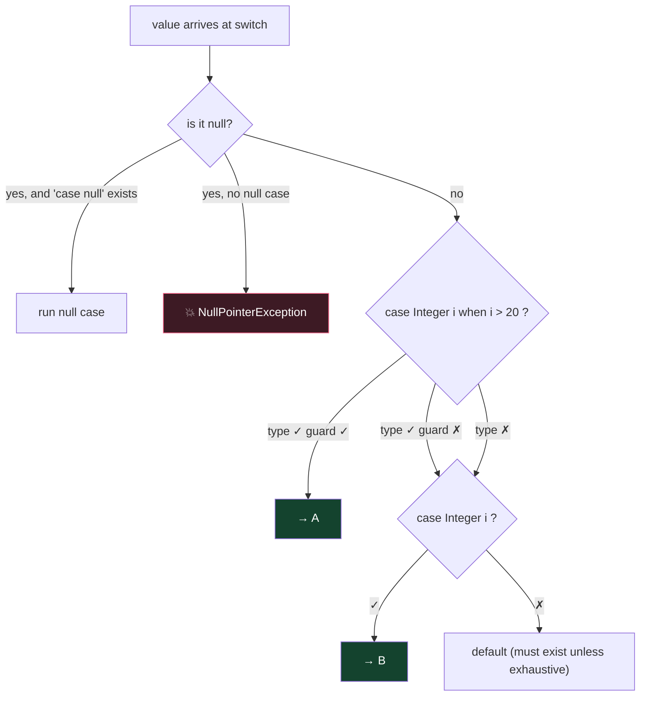

# Module 02 — Flow Control (switch is the #1 exam battlefield)

## 1. if / loops essentials
- `if (x = 5)` ❌ won't compile UNLESS x is boolean (`if (flag = true)` ✅ compiles and is a trap — assignment evaluates to true!).
- for loop parts are all optional: `for(;;)` = infinite. Multiple init vars must be same type: `for (int i=0, j=1; ...)` ✅; `for (int i=0, long j=1; ...)` ❌.
- do/while runs at least once; `while` needs `{}` or single statement — `while (false) { }` ❌ compile error (unreachable), but `if (false) {}` ✅ (special allowance for debug flags).
- **Labels:** `outer: for(...) { for(...) { break outer; } }` — `break label` exits the labeled loop entirely; `continue label` jumps to next iteration of labeled loop.

## 2. Classic switch STATEMENT
- Selector types: `byte short char int`, their wrappers, `String`, `enum` (+ patterns since 21). ❌ `long, float, double, boolean`.
- Case labels must be **compile-time constants** (literals, final constants, enum names).
- **Fall-through**: without `break`, execution continues into next cases including `default` wherever it sits.
- `default` can appear anywhere; it's used only if no case matches — but once entered, falls through too.

## 3. switch EXPRESSION (returns a value)
```java
int size = switch (s) {
    case "S" -> 1;
    case "M", "L" -> 2;              // multiple labels
    default -> { int x = 3; yield x; } // block needs yield
};                                    // ← semicolon required!
```
Rules to memorize:
1. Arrow `->` cases never fall through; no `break` needed.
2. A block on the right MUST `yield` a value (not `return`!).
3. Old `case X:` syntax can also be used in an expression but then you `yield` (fall-through still possible).
4. ❌ Cannot mix `->` and `:` in one switch.
5. **Must be exhaustive**: cover all cases or have `default` (enums covering all constants: no default needed; sealed types covered exhaustively: no default needed).
6. Every branch must yield a value or throw — a branch that just "ends" ❌.

## 4. Pattern matching in switch (heavily tested)
```java
Object o = ...;
String r = switch (o) {
    case null           -> "null!";          // without this, null → NPE
    case Integer i when i > 10 -> "big int"; // guarded pattern
    case Integer i      -> "int " + i;
    case String s       -> "str " + s;
    default             -> "other";
};
```
- ⚠️ **Dominance:** a more general pattern before a specific one = compile error (`case Object o` before `case String s` ❌). Guarded before unguarded of same type ✅ required order.
- `case null` may combine: `case null, default ->`.
- Selector can be any reference type now.
- Pattern variables are scoped to their branch (flow scoping).
- `instanceof` pattern: `if (o instanceof String s && s.length() > 2)` — `s` in scope where the compiler can PROVE the match: after `&&` ✅, after `||` ❌; also `if (!(o instanceof String s)) return;` → `s` usable after the if.

## 5. Unnamed variables & patterns `_` (Java 22 — new on this exam!)
```java
for (var _ : list) count++;                 // unused loop var
try { ... } catch (IOException _) { ... }   // unused exception
case Point(int x, int _) -> x;              // ignore a record component
var _ = someCall();                         // discard result
```
- `_` can be declared multiple times in the same scope (unlike normal vars) but can NEVER be read.

## ⚠️ Top traps
1. Missing `break` fall-through prints more than expected.
2. switch expression without `default` on a non-exhaustive selector → compile error.
3. `return` inside a switch-expression block instead of `yield` → compile error.
4. Dominated pattern order → compile error.
5. `case 5:` when selector is `long` → the whole switch doesn't compile.
6. Guard `when` only works with patterns, not constants: `case 5 when x>2` ❌.

---

## 🧠 Visual — pattern-switch decision flow

*(Animated dispatch & control-flow demos: [`interactive/java-internals-visualizer.html`](../../interactive/java-internals-visualizer.html))*



**Dominance rule drawn:** a broader/unguarded pattern ABOVE a narrower/guarded one makes the lower case unreachable → compile error. Order top-down = specific → general.
