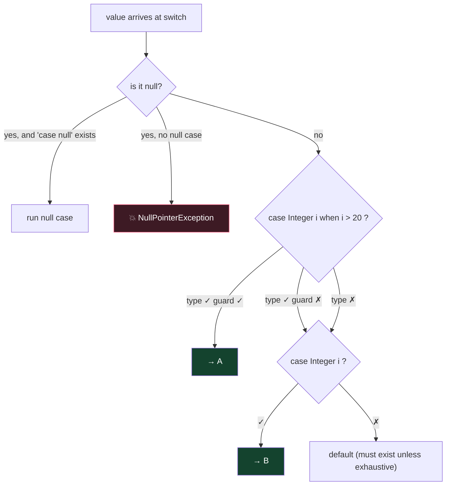

# Module 02 — Flow Control (switch is the #1 exam battlefield)

## 1. if / loops essentials
- `if (x = 5)` ❌ won't compile UNLESS x is boolean (`if (flag = true)` ✅ compiles and is a trap — assignment evaluates to true!).
- for loop parts are all optional: `for(;;)` = infinite. Multiple init vars must be same type: `for (int i=0, j=1; ...)` ✅; `for (int i=0, long j=1; ...)` ❌.
- do/while runs at least once; `while` needs `{}` or single statement — `while (false) { }` ❌ compile error (unreachable), but `if (false) {}` ✅ (special allowance for debug flags).
- **Labels:** `outer: for(...) { for(...) { break outer; } }` — `break label` exits the labeled loop entirely; `continue label` jumps to next iteration of labeled loop.

## 2. Classic switch STATEMENT
- Selector types: `byte short char int`, their wrappers, `String`, `enum` (+ patterns since 21). ❌ `long, float, double, boolean`.
- Case labels must be **compile-time constants** (literals, final constants, enum names).
- **Fall-through**: without `break`, execution continues into next cases including `default` wherever it sits.
- `default` can appear anywhere; it's used only if no case matches — but once entered, falls through too.

## 3. switch EXPRESSION (returns a value)
```java
int size = switch (s) {
    case "S" -> 1;
    case "M", "L" -> 2;              // multiple labels
    default -> { int x = 3; yield x; } // block needs yield
};                                    // ← semicolon required!
```
Rules to memorize:
1. Arrow `->` cases never fall through; no `break` needed.
2. A block on the right MUST `yield` a value (not `return`!).
3. Old `case X:` syntax can also be used in an expression but then you `yield` (fall-through still possible).
4. ❌ Cannot mix `->` and `:` in one switch.
5. **Must be exhaustive**: cover all cases or have `default` (enums covering all constants: no default needed; sealed types covered exhaustively: no default needed).
6. Every branch must yield a value or throw — a branch that just "ends" ❌.

## 4. Pattern matching in switch (heavily tested)
```java
Object o = ...;
String r = switch (o) {
    case null           -> "null!";          // without this, null → NPE
    case Integer i when i > 10 -> "big int"; // guarded pattern
    case Integer i      -> "int " + i;
    case String s       -> "str " + s;
    default             -> "other";
};
```
- ⚠️ **Dominance:** a more general pattern before a specific one = compile error (`case Object o` before `case String s` ❌). Guarded before unguarded of same type ✅ required order.
- `case null` may combine: `case null, default ->`.
- Selector can be any reference type now.
- Pattern variables are scoped to their branch (flow scoping).
- `instanceof` pattern: `if (o instanceof String s && s.length() > 2)` — `s` in scope where the compiler can PROVE the match: after `&&` ✅, after `||` ❌; also `if (!(o instanceof String s)) return;` → `s` usable after the if.

## 5. Unnamed variables & patterns `_` (Java 22 — new on this exam!)
```java
for (var _ : list) count++;                 // unused loop var
try { ... } catch (IOException _) { ... }   // unused exception
case Point(int x, int _) -> x;              // ignore a record component
var _ = someCall();                         // discard result
```
- `_` can be declared multiple times in the same scope (unlike normal vars) but can NEVER be read.

## ⚠️ Top traps
1. Missing `break` fall-through prints more than expected.
2. switch expression without `default` on a non-exhaustive selector → compile error.
3. `return` inside a switch-expression block instead of `yield` → compile error.
4. Dominated pattern order → compile error.
5. `case 5:` when selector is `long` → the whole switch doesn't compile.
6. Guard `when` only works with patterns, not constants: `case 5 when x>2` ❌.

---

## 🧠 Visual — pattern-switch decision flow

*(Animated dispatch & control-flow demos: [`interactive/java-internals-visualizer.html`](../../interactive/java-internals-visualizer.html))*



**Dominance rule drawn:** a broader/unguarded pattern ABOVE a narrower/guarded one makes the lower case unreachable → compile error. Order top-down = specific → general.

---

## 🧭 The mental model — two switches and one scoping rule

Flow control looks easy and then costs people marks, because three separate things wear the same clothes:

1. **Statement vs expression.** A switch *statement* does something. A switch *expression* produces a value, and therefore must be **exhaustive** and must use `yield` from a block. Everything the exam asks about `default` follows from this.
2. **Colon vs arrow.** Colon form falls through. Arrow form never does. Arrow form also allows multiple labels per branch.
3. **Definite assignment governs pattern scope.** A pattern variable exists wherever the pattern is *provably* true. That is why `o instanceof String s && s.length() > 0` compiles but the `||` version does not.

> **Expressions must be exhaustive; arrows never fall through; patterns live where they are proven.**

## 🔬 Worked trace — fall-through, both forms

```java
int x = 2;
switch (x) {                     // COLON form
    case 1: System.out.print("a");
    case 2: System.out.print("b");
    case 3: System.out.print("c");
}
// prints  bc   — enters at 2, then keeps going

switch (x) {                     // ARROW form
    case 1 -> System.out.print("a");
    case 2 -> System.out.print("b");
    case 3 -> System.out.print("c");
}
// prints  b    — one branch, no fall-through
```

Execution *enters* at the matching label and, in colon form, runs everything below it until a `break` or the closing brace. It is not "matching each case in turn" — it is a jump followed by ordinary sequential execution.

## 🔬 Worked trace — exhaustiveness, and why sealed types pay off

```java
sealed interface Shape permits Circle, Square {}
record Circle(double r) implements Shape {}
record Square(double s) implements Shape {}

String f(Shape sh) {
    return switch (sh) {         // no default needed
        case Circle c -> "circle";
        case Square q -> "square";
    };
}
```

The compiler can enumerate every permitted subtype, so it *proves* the switch is exhaustive. Now add `record Tri(...) implements Shape` to the permits clause: this method **stops compiling**, pointing you at every place that needs updating.

That is the whole payoff of sealing — the compiler becomes a checklist. With a `default` branch you would have lost it, silently returning "square" for triangles forever.

## 🔬 Worked trace — pattern scope and `&&` versus `||`

```java
if (o instanceof String s && s.length() > 2) { }   // ✔ s in scope on the right of &&
if (o instanceof String s || s.length() > 2) { }   // ✘ s NOT in scope
```

With `&&`, the right operand only evaluates when the left was **true**, so `s` is definitely assigned. With `||`, the right operand evaluates precisely when the left was **false** — so `s` may not exist. The compiler is not being fussy; it is preventing a guaranteed crash.

The same rule runs in reverse:

```java
if (!(o instanceof String s)) return;
System.out.println(s.length());   // ✔ s IS in scope here
```

After an early return, the only way to reach line 2 is if the pattern matched.

## 🎭 Why the wrong answer looks right

| Tempting belief | Why it's tempting | The truth |
|---|---|---|
| "Every switch needs a `default`" | Habit from statements | Switch **expressions** need exhaustiveness — which enums and sealed types can supply without `default`. Statements never require it |
| "Arrow form can fall through if you omit `break`" | Colon form does | Arrow form never falls through, and `break` isn't even valid there |
| "`return` works inside a switch expression" | It's inside a method | Illegal. Use `yield` from a block, or a bare expression |
| "`case null` is never allowed" | Classic switch NPEs on null | **Pattern** switches permit `case null` explicitly. Without it, a null selector throws |
| "You can switch on a `long`" | It's an integral type | Only byte, short, char, int, their wrappers, String and enum — plus anything in a pattern switch |
| "Guarded patterns can go in any order" | They're separate cases | A general pattern before its guarded version makes the guarded one **unreachable** — a compile error |
| "`for (...);` with a semicolon is a typo the compiler catches" | It's obviously wrong | It compiles. The loop body is empty and the following statement runs once |
| "Enhanced-for lets you remove safely if it's the last element" | It sometimes appears to work | Undefined. Use `Iterator.remove()` or `removeIf()` |

## 🔁 Recall ladder

1. What forces a switch to be exhaustive, and what two things can satisfy it without `default`?
2. Trace the output of a colon-form switch with no breaks entered at the middle label.
3. Which keyword returns a value from a switch expression block, and which keyword is illegal there?
4. Why is `s` in scope after `&&` but not after `||`?
5. Write the early-return form that puts a pattern variable in scope for the rest of the method.
6. What happens when a pattern switch receives `null`, with and without `case null`?
7. Why must a guarded pattern precede its unguarded twin?
8. Name every legal selector type for a traditional switch.
9. `continue outer;` in a nested loop — exactly what runs next?
10. Two ways to remove from a collection while iterating it.
