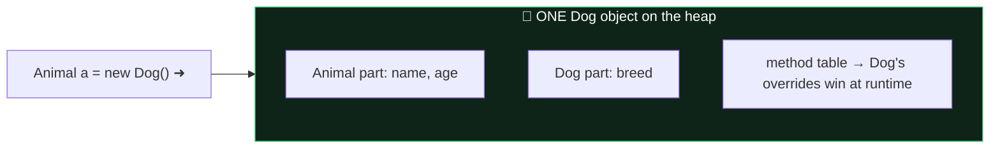

# Module 03 — OOP Core

## 1. Initialization ORDER (guaranteed exam question)
1. Superclass statics → subclass statics (once per class, in code order; static fields + static blocks together in order).
2. Then per `new`: superclass instance fields+blocks (in order) → superclass constructor → subclass instance fields+blocks → subclass constructor.

Memorize: **"Static super, static sub, then per object: fields/blocks-super, ctor-super, fields/blocks-sub, ctor-sub."**

## 2. Constructors
- No constructor written → compiler adds a no-arg default. Write ANY constructor → default is gone (subclass `super()` calls may break!).
- `this(...)` / `super(...)`: at most one, and traditionally first statement.
- **Java 25 — Flexible Constructor Bodies (JEP 513, FINAL):** statements may now appear BEFORE `super(...)`/`this(...)` in a *prologue*:
```java
class Employee extends Person {
    final int grade;
    Employee(int g) {
        if (g < 1) throw new IllegalArgumentException(); // ✅ validate first!
        var normalized = Math.min(g, 10);                // ✅ compute args
        grade = normalized;                              // ✅ may init OWN fields
        super(normalized);                               // explicit call still required if not first? -> call ends the prologue
    }
}
```
  Prologue restrictions: ❌ cannot use `this` (no reading instance fields, no instance method calls, no passing `this`), ❌ cannot `return`, ✅ may assign the class's own fields (so a superclass-constructor-invoked overridden method sees them initialized!). Still exactly ONE `super()`/`this()` call max.

## 3. Overriding vs Overloading vs Hiding
**Override rules ("same, broader, narrower"):**
- Same name + same parameter list; return type: same or **covariant** (subtype) for references; must be identical for primitives.
- Access: same or MORE accessible. `protected` → `private` ❌.
- Checked exceptions: same, fewer, or NARROWER. New/broader checked ❌ (unchecked = free).
- `static` methods are **hidden**, not overridden → resolved by REFERENCE type. Instance methods → RUNTIME type (polymorphism). Fields are ALWAYS hidden → reference type.
- ❌ can't override: `final`, `private` (redeclaring private isn't overriding), `static` with instance or vice-versa.

```java
Parent p = new Child();
p.instanceMethod();  // Child's
p.staticMethod();    // Parent's (reference type!)
System.out.print(p.field);  // Parent's field
```

**Overloading:** same name, different parameter list. Resolution order: exact → widening → autoboxing → varargs. (`f(int)` beats `f(long)` beats `f(Integer)` beats `f(int...)` for an int argument.)

## 4. Casting & instanceof
- Upcast implicit; downcast explicit; wrong downcast → `ClassCastException` at runtime; cast between unrelated CLASSES → compile error; cast to an interface usually compiles (a subclass might implement it) unless class is final.
- `instanceof` with unrelated types → compile error. `null instanceof X` → always false.

## 5. Interfaces
- Fields: implicitly `public static final` (must be initialized).
- Methods: implicitly `public abstract`; can also be `default` (instance, with body), `static` (NOT inherited — call via interface name!), `private` / `private static` (helpers).
- ❌ no protected or package-private methods; ❌ default methods can't be final; interfaces have no constructors, never `final`.
- **Diamond default conflict:** class implements two interfaces with same default method → MUST override (can delegate: `InterfaceA.super.method()`).
- Class beats interface: superclass concrete method wins over interface default.

## 6. Abstract classes
- Can have constructors (invoked via subclass `super()`), any fields, any access. Can be extended, not instantiated.
- ❌ `abstract final`, `abstract private`, `abstract static` method combos.
- First concrete subclass must implement ALL inherited abstract methods.

## 7. Nested classes
| Kind | Static? | Can access outer instance? | Notes |
|------|---------|---------------------------|-------|
| static nested | yes | no (only outer statics) | `new Outer.Nested()` |
| inner (member) | no | yes | `outer.new Inner()`; can't have static members except constants |
| local (in method) | no | yes + effectively-final locals | no access modifiers |
| anonymous | no | yes + effectively-final locals | extends/implements exactly one type; no ctor |

## 8. `var`
- Local variables (and for/try headers) only. Needs an initializer, not `null` alone, no fields/params/return types, no `var x = {1,2}` array initializer, can't be reassigned to a different type. `var` is a reserved *type name*, not a keyword (`int var = 3;` legal but evil).

## ⚠️ Top traps
1. Fields & static methods: reference type. Instance methods: object type.
2. Parent defines only `Parent(int x)` → child's implicit `super()` fails → compile error.
3. Overriding method declaring broader checked exception → compile error.
4. `interface` static method called on implementing class name → compile error.
5. Order-of-initialization output questions — draw the timeline.

---

## 🧠 Memory View — objects, inheritance & `this`

**An object of a subclass is ONE heap object containing all inherited fields:**



That's why **overridden methods use the OBJECT's type (runtime) while hidden static methods and FIELDS use the REFERENCE's type (compile time)** — fields have no method table.

**Pass-by-value recap** ([full animation](../../interactive/memory-visualizer.html)): the callee's parameter is a *copied arrow* in a *new stack frame* — mutation through it is visible, reassignment is not.

**`final` freezes the arrow, never the object:**


---

## 🧭 The mental model — two different questions, asked at two different times

Nearly every OOP trap on this exam reduces to one distinction:

- **Fields and static methods are resolved by the compiler**, using the *reference* type. Decided before the program runs.
- **Instance methods are resolved by the JVM**, using the *object* type. Decided at the moment of the call.

That is the whole of it. Fields are **hidden**, not overridden. Static methods are **hidden**, not overridden. Only instance methods are genuinely polymorphic.

```java
class P { String n = "P"; String get() { return "P"; } }
class C extends P { String n = "C"; String get() { return "C"; } }

P o = new C();
o.n      // "P"  — compiler looked at the reference type P
o.get()  // "C"  — JVM looked at the object, which is a C
```

One object, two different answers, in the same expression. If you can explain *why* without hesitating, you have most of this module.

The second organising idea is **construction order**, because it explains a whole family of surprises: a parent constructor runs *before* the child's fields are initialised, so an overridden method called from a parent constructor sees `null`.

> **Compiler sees the reference. JVM sees the object. Parents are built before children.**

## 🔬 Worked trace — the full initialisation order

```java
class A {
    static { System.out.print("A-static "); }
    { System.out.print("A-init "); }
    A() { System.out.print("A-ctor "); }
}
class B extends A {
    static { System.out.print("B-static "); }
    { System.out.print("B-init "); }
    B() { System.out.print("B-ctor "); }
}
// new B();  new B();
```

Output: `A-static B-static A-init A-ctor B-init B-ctor A-init A-ctor B-init B-ctor`

The order, and the reason for each:

| Phase | Runs | When |
|---|---|---|
| 1 | Parent statics, then child statics | **Once**, at class load. Parent first because loading `B` requires `A` |
| 2 | Implicit `super()` → parent instance initialisers → parent constructor body | Every `new` |
| 3 | Child instance initialisers → child constructor body | Every `new` |

Note the pairing: instance initialiser blocks always run **immediately before the constructor body of the same class**, and after that class's `super()` call has returned.

## 🔬 Worked trace — the constructor that reads `null`

```java
class Base {
    Base() { show(); }                       // ② calls the OVERRIDE
    void show() { System.out.println("base"); }
}
class Derived extends Base {
    private String label = "ready";          // ③ runs AFTER Base() returns
    @Override void show() { System.out.println(label); }
}
// new Derived();  →  prints  null
```

1. `new Derived()` calls `Derived()`, which begins with an implicit `super()`.
2. `Base()` runs and calls `show()`. Dispatch is polymorphic, so **`Derived.show()` executes** — against an object whose fields have not been initialised yet.
3. `label` is still `null`. It is assigned only after `Base()` returns.

This is why "never call an overridable method from a constructor" is a rule and not a preference. Make such methods `private`, `static`, or `final`.

## 🔬 Worked trace — overload resolution, in order

```java
void f(long x)      { print("long");    }
void f(Integer x)   { print("Integer"); }
void f(Object x)    { print("Object");  }
void f(int... x)    { print("varargs"); }

f(5);   // → "long"
```

The compiler makes **three passes**, and only moves on when no candidate matches:

1. **Exact match / widening primitive.** `int → long` works → **`long` wins.** Search stops.
2. Boxing (`int → Integer`, then widening reference to `Object`) — never reached.
3. Varargs — always last resort.

Delete `f(long)` and it prints `Integer`. Delete that too and you get `Object`. Delete that and finally `varargs`. **Varargs never wins while any other candidate exists.**

## 🎭 Why the wrong answer looks right

| Tempting belief | Why it's tempting | The truth |
|---|---|---|
| "Fields are polymorphic like methods" | They're both members | Fields are **hidden**, resolved by the reference type at compile time |
| "You can override a static method" | It compiles and looks overridden | It's **hiding**. `P.s()` always calls `P`'s version |
| "An override can throw broader checked exceptions" | It's a subclass, it does more | Checked exceptions may only **narrow or vanish**. Unchecked are unrestricted |
| "An override can reduce visibility" | Tightening sounds safe | Visibility may only **widen**. `public` → `protected` won't compile |
| "Changing the parameter type overrides" | Same name, same idea | Different parameters = **overload**, not override. `@Override` catches this |
| "Abstract classes can't have constructors" | You can't instantiate them | They can, and must — subclasses call `super()` |
| "Two interfaces with the same default is fine" | Java picks one | **Compile error.** You must override and may delegate with `A.super.hi()` |
| "Nothing may precede `super()`" | True for twenty years | **Java 25 (JEP 513)** allows a prologue: validate arguments, assign your own fields. Just no `this` |
| "`final` on a field freezes the object" | The word says final | It freezes the **reference**. `final List` can still be added to |
| "A subclass constructor works without a matching parent constructor" | It compiles in simple cases | Only if the parent has an accessible no-arg constructor — the implicit `super()` needs a target |

## 🔁 Recall ladder

1. In `P o = new C();`, why do `o.n` and `o.get()` disagree?
2. Write the ten-token output order for a two-level hierarchy with statics, instance blocks and constructors, instantiated twice.
3. Why does an overridden method called from a parent constructor see `null`?
4. Name the three passes of overload resolution, in order.
5. Four things an override may not do.
6. Two interfaces, same default method, one class — what does the compiler demand, and what's the delegation syntax?
7. What exactly may appear before `super()` in Java 25, and what may not?
8. Static nested versus inner class: which needs an enclosing instance, and how do you instantiate each?
9. Where is a package-private member visible? Where does `protected` reach that it doesn't?
10. `final` on a class, a method, a field, a parameter — one sentence each.
