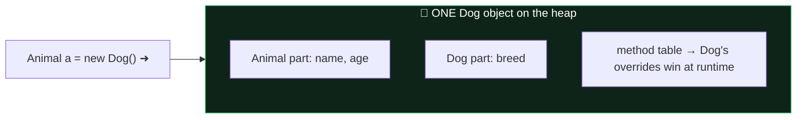

# Module 03 — OOP Core

## 1. Initialization ORDER (guaranteed exam question)
1. Superclass statics → subclass statics (once per class, in code order; static fields + static blocks together in order).
2. Then per `new`: superclass instance fields+blocks (in order) → superclass constructor → subclass instance fields+blocks → subclass constructor.

Memorize: **"Static super, static sub, then per object: fields/blocks-super, ctor-super, fields/blocks-sub, ctor-sub."**

## 2. Constructors
- No constructor written → compiler adds a no-arg default. Write ANY constructor → default is gone (subclass `super()` calls may break!).
- `this(...)` / `super(...)`: at most one, and traditionally first statement.
- **Java 25 — Flexible Constructor Bodies (JEP 513, FINAL):** statements may now appear BEFORE `super(...)`/`this(...)` in a *prologue*:
```java
class Employee extends Person {
    final int grade;
    Employee(int g) {
        if (g < 1) throw new IllegalArgumentException(); // ✅ validate first!
        var normalized = Math.min(g, 10);                // ✅ compute args
        grade = normalized;                              // ✅ may init OWN fields
        super(normalized);                               // explicit call still required if not first? -> call ends the prologue
    }
}
```
  Prologue restrictions: ❌ cannot use `this` (no reading instance fields, no instance method calls, no passing `this`), ❌ cannot `return`, ✅ may assign the class's own fields (so a superclass-constructor-invoked overridden method sees them initialized!). Still exactly ONE `super()`/`this()` call max.

## 3. Overriding vs Overloading vs Hiding
**Override rules ("same, broader, narrower"):**
- Same name + same parameter list; return type: same or **covariant** (subtype) for references; must be identical for primitives.
- Access: same or MORE accessible. `protected` → `private` ❌.
- Checked exceptions: same, fewer, or NARROWER. New/broader checked ❌ (unchecked = free).
- `static` methods are **hidden**, not overridden → resolved by REFERENCE type. Instance methods → RUNTIME type (polymorphism). Fields are ALWAYS hidden → reference type.
- ❌ can't override: `final`, `private` (redeclaring private isn't overriding), `static` with instance or vice-versa.

```java
Parent p = new Child();
p.instanceMethod();  // Child's
p.staticMethod();    // Parent's (reference type!)
System.out.print(p.field);  // Parent's field
```

**Overloading:** same name, different parameter list. Resolution order: exact → widening → autoboxing → varargs. (`f(int)` beats `f(long)` beats `f(Integer)` beats `f(int...)` for an int argument.)

## 4. Casting & instanceof
- Upcast implicit; downcast explicit; wrong downcast → `ClassCastException` at runtime; cast between unrelated CLASSES → compile error; cast to an interface usually compiles (a subclass might implement it) unless class is final.
- `instanceof` with unrelated types → compile error. `null instanceof X` → always false.

## 5. Interfaces
- Fields: implicitly `public static final` (must be initialized).
- Methods: implicitly `public abstract`; can also be `default` (instance, with body), `static` (NOT inherited — call via interface name!), `private` / `private static` (helpers).
- ❌ no protected or package-private methods; ❌ default methods can't be final; interfaces have no constructors, never `final`.
- **Diamond default conflict:** class implements two interfaces with same default method → MUST override (can delegate: `InterfaceA.super.method()`).
- Class beats interface: superclass concrete method wins over interface default.

## 6. Abstract classes
- Can have constructors (invoked via subclass `super()`), any fields, any access. Can be extended, not instantiated.
- ❌ `abstract final`, `abstract private`, `abstract static` method combos.
- First concrete subclass must implement ALL inherited abstract methods.

## 7. Nested classes
| Kind | Static? | Can access outer instance? | Notes |
|------|---------|---------------------------|-------|
| static nested | yes | no (only outer statics) | `new Outer.Nested()` |
| inner (member) | no | yes | `outer.new Inner()`; can't have static members except constants |
| local (in method) | no | yes + effectively-final locals | no access modifiers |
| anonymous | no | yes + effectively-final locals | extends/implements exactly one type; no ctor |

## 8. `var`
- Local variables (and for/try headers) only. Needs an initializer, not `null` alone, no fields/params/return types, no `var x = {1,2}` array initializer, can't be reassigned to a different type. `var` is a reserved *type name*, not a keyword (`int var = 3;` legal but evil).

## ⚠️ Top traps
1. Fields & static methods: reference type. Instance methods: object type.
2. Parent defines only `Parent(int x)` → child's implicit `super()` fails → compile error.
3. Overriding method declaring broader checked exception → compile error.
4. `interface` static method called on implementing class name → compile error.
5. Order-of-initialization output questions — draw the timeline.

---

## 🧠 Memory View — objects, inheritance & `this`

**An object of a subclass is ONE heap object containing all inherited fields:**



That's why **overridden methods use the OBJECT's type (runtime) while hidden static methods and FIELDS use the REFERENCE's type (compile time)** — fields have no method table.

**Pass-by-value recap** ([full animation](../../interactive/memory-visualizer.html)): the callee's parameter is a *copied arrow* in a *new stack frame* — mutation through it is visible, reassignment is not.

**`final` freezes the arrow, never the object:**


