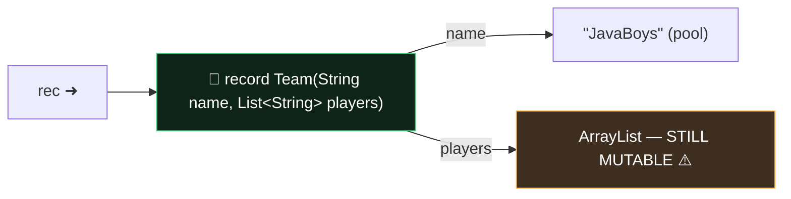

# Module 04 — Records, Enums, Sealed Types

## 1. Records
```java
public record Point(int x, int y) { }
```
You get free: private final fields, accessors `x()` / `y()` (NOT getX!), canonical constructor, `equals`, `hashCode`, `toString`.

Rules:
- Implicitly **final** (can't be extended); extends `java.lang.Record` implicitly → ❌ cannot `extends` anything else; ✅ CAN implement interfaces.
- ❌ NO additional *instance* fields. ✅ static fields, static & instance methods, nested types OK.
- **Compact constructor** — validates/normalizes; NO parentheses, NO explicit field assignment (implicit assignment happens at the end):
```java
record Range(int lo, int hi) {
    Range {                              // compact
        if (lo > hi) throw new IllegalArgumentException();
        lo = Math.max(lo, 0);            // reassigns the PARAMETER (ok)
        // this.lo = lo;                 // ❌ compile error in compact ctor
    }
}
```
- Overloaded constructors MUST delegate (directly or indirectly) to the canonical one via `this(...)` as first statement.
- Canonical constructor access must be at least as accessible as the record.
- Records can be generic, can be local (declared inside a method!), are shallowly immutable (a mutable List component can still change internally).

**Record patterns (deconstruction):**
```java
if (o instanceof Point(int x, int y)) ...          // binds components
switch (o) { case Point(var x, var y) -> x + y; ...}
case Line(Point(var x1, var _), Point(var x2, var _)) -> ...   // nested + unnamed
```
- Types in the pattern must match component types (or `var`); wrong arity/type ❌.

## 2. Enums
```java
enum Season {
    WINTER("cold") { String hint() { return "ski"; } },  // constant body
    SUMMER("hot")  { String hint() { return "swim"; } };

    private final String desc;
    Season(String d) { desc = d; }        // implicitly PRIVATE (public ❌)
    abstract String hint();               // forces every constant to implement
}
```
- Implicitly final (unless constants have bodies — then implicitly sealed-ish, still can't be extended by you) and extend `java.lang.Enum` → ❌ no extends; ✅ implements interfaces.
- Constants list MUST come first; semicolon after it required if more members follow.
- `values()`, `valueOf("WINTER")` (💥 IllegalArgumentException on bad name, case-sensitive), `name()`, `ordinal()` (0-based), `compareTo` uses ordinal.
- Constructors run ONCE per constant, lazily at first use of the enum, top to bottom.
- ⚠️ In switch cases: use the bare name `case WINTER`, NOT `case Season.WINTER` (classic switch). Enum switch covering all constants = exhaustive without default.

## 3. Sealed types
```java
public sealed interface Vehicle permits Car, Bike { }
public final  class Car  implements Vehicle { }
public non-sealed class Bike implements Vehicle { }   // reopens hierarchy
```
- Every permitted subclass MUST: (a) directly extend/implement the sealed type, (b) be `final`, `sealed`, or `non-sealed` — exactly one required, (c) same module, or same package in the unnamed module.
- `permits` clause optional if all subclasses live in the SAME FILE.
- Records & enums may implement sealed interfaces (they're implicitly final).
- Big payoff: **exhaustive switch without default** over sealed hierarchies.
- Sealed classes may be abstract. Interfaces can't be `final`, so a permitted sub-interface must be `sealed` or `non-sealed`.

## ⚠️ Top traps
1. Record accessor is `x()`, not `getX()`. Adding an instance field to a record ❌.
2. Compact constructor with parentheses `Range() {}` → that's a no-arg overload, different thing!
3. `valueOf("winter")` lowercase → runtime exception.
4. Permitted subclass missing final/sealed/non-sealed modifier → compile error.
5. Record pattern arity mismatch `Point(var x)` for a 2-component record → compile error.
6. Enum constructor declared `public` → compile error.

---

## 🧠 Memory View — records are shallow!



A record's *components* are final arrows — but the objects they point to can mutate. `team.players().add("hacker")` compiles and works! Defensive copy in the compact constructor (`players = List.copyOf(players);`) fixes it — classic exam + interview question.

**Enums in memory:** each constant is ONE static singleton object created during class initialization (before static blocks!) — that's why `==` is safe for enums and why the CCS0-style ordering questions exist.
