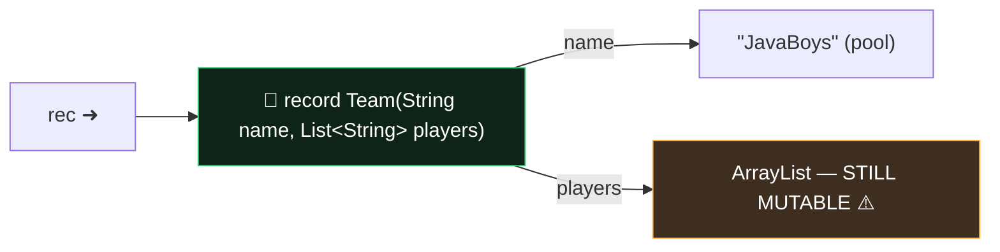

# Module 04 — Records, Enums, Sealed Types

## 1. Records
```java
public record Point(int x, int y) { }
```
You get free: private final fields, accessors `x()` / `y()` (NOT getX!), canonical constructor, `equals`, `hashCode`, `toString`.

Rules:
- Implicitly **final** (can't be extended); extends `java.lang.Record` implicitly → ❌ cannot `extends` anything else; ✅ CAN implement interfaces.
- ❌ NO additional *instance* fields. ✅ static fields, static & instance methods, nested types OK.
- **Compact constructor** — validates/normalizes; NO parentheses, NO explicit field assignment (implicit assignment happens at the end):
```java
record Range(int lo, int hi) {
    Range {                              // compact
        if (lo > hi) throw new IllegalArgumentException();
        lo = Math.max(lo, 0);            // reassigns the PARAMETER (ok)
        // this.lo = lo;                 // ❌ compile error in compact ctor
    }
}
```
- Overloaded constructors MUST delegate (directly or indirectly) to the canonical one via `this(...)` as first statement.
- Canonical constructor access must be at least as accessible as the record.
- Records can be generic, can be local (declared inside a method!), are shallowly immutable (a mutable List component can still change internally).

**Record patterns (deconstruction):**
```java
if (o instanceof Point(int x, int y)) ...          // binds components
switch (o) { case Point(var x, var y) -> x + y; ...}
case Line(Point(var x1, var _), Point(var x2, var _)) -> ...   // nested + unnamed
```
- Types in the pattern must match component types (or `var`); wrong arity/type ❌.

## 2. Enums
```java
enum Season {
    WINTER("cold") { String hint() { return "ski"; } },  // constant body
    SUMMER("hot")  { String hint() { return "swim"; } };

    private final String desc;
    Season(String d) { desc = d; }        // implicitly PRIVATE (public ❌)
    abstract String hint();               // forces every constant to implement
}
```
- Implicitly final (unless constants have bodies — then implicitly sealed-ish, still can't be extended by you) and extend `java.lang.Enum` → ❌ no extends; ✅ implements interfaces.
- Constants list MUST come first; semicolon after it required if more members follow.
- `values()`, `valueOf("WINTER")` (💥 IllegalArgumentException on bad name, case-sensitive), `name()`, `ordinal()` (0-based), `compareTo` uses ordinal.
- Constructors run ONCE per constant, lazily at first use of the enum, top to bottom.
- ⚠️ In switch cases: use the bare name `case WINTER`, NOT `case Season.WINTER` (classic switch). Enum switch covering all constants = exhaustive without default.

## 3. Sealed types
```java
public sealed interface Vehicle permits Car, Bike { }
public final  class Car  implements Vehicle { }
public non-sealed class Bike implements Vehicle { }   // reopens hierarchy
```
- Every permitted subclass MUST: (a) directly extend/implement the sealed type, (b) be `final`, `sealed`, or `non-sealed` — exactly one required, (c) same module, or same package in the unnamed module.
- `permits` clause optional if all subclasses live in the SAME FILE.
- Records & enums may implement sealed interfaces (they're implicitly final).
- Big payoff: **exhaustive switch without default** over sealed hierarchies.
- Sealed classes may be abstract. Interfaces can't be `final`, so a permitted sub-interface must be `sealed` or `non-sealed`.

## ⚠️ Top traps
1. Record accessor is `x()`, not `getX()`. Adding an instance field to a record ❌.
2. Compact constructor with parentheses `Range() {}` → that's a no-arg overload, different thing!
3. `valueOf("winter")` lowercase → runtime exception.
4. Permitted subclass missing final/sealed/non-sealed modifier → compile error.
5. Record pattern arity mismatch `Point(var x)` for a 2-component record → compile error.
6. Enum constructor declared `public` → compile error.

---

## 🧠 Memory View — records are shallow!



A record's *components* are final arrows — but the objects they point to can mutate. `team.players().add("hacker")` compiles and works! Defensive copy in the compact constructor (`players = List.copyOf(players);`) fixes it — classic exam + interview question.

**Enums in memory:** each constant is ONE static singleton object created during class initialization (before static blocks!) — that's why `==` is safe for enums and why the CCS0-style ordering questions exist.

---

## 🧭 The mental model — modelling data instead of behaviour

Records, enums and sealed types all answer the same design question from different angles: **how do I tell the compiler exactly what shapes my data can take?**

- A **record** says "this value *is* its components, nothing more." That single sentence generates the constructor, accessors, `equals`, `hashCode` and `toString` — and explains every restriction. No extra instance fields, because the state *is* the components. Implicitly final, because subclassing would add state the generated `equals` can't see.
- An **enum** says "there are exactly these instances, and no others." Hence the private constructor and `values()`.
- A **sealed** type says "there are exactly these subtypes, and no others." Hence `permits`, and hence exhaustive switches with no `default`.

Put them together and you get **algebraic data modelling**: a sealed interface enumerating the cases, records carrying each case's data, and a pattern switch that the compiler forces you to keep complete.

> **Records fix the shape, enums fix the instances, sealed fixes the subtypes.** All three trade flexibility for compile-time certainty — and the exam tests that trade.

## 🔬 Worked trace — the compact constructor

```java
record Range(int lo, int hi) {
    Range {                                    // no parameter list
        if (lo > hi) { int t = lo; lo = hi; hi = t; }
    }
}
new Range(9, 2);   // → Range[lo=2, hi=9]
```

| Step | What happens |
|---|---|
| 1 | The canonical constructor receives parameters `lo = 9`, `hi = 2` |
| 2 | Your compact body runs and **reassigns the parameters** to 2 and 9 |
| 3 | The compiler appends the implicit `this.lo = lo; this.hi = hi;` |
| 4 | Fields are set from the *modified* parameters |

The critical detail: you assign to the **parameter**, never `this.lo`. Writing `this.lo = ...` inside a compact constructor is a compile error, because the implicit assignment would overwrite it anyway.

## 🔬 Worked trace — where record equality goes wrong

```java
record Tag(String[] values) {}
var a = new Tag(new String[]{"x"});
var b = new Tag(new String[]{"x"});
a.equals(b);   // false
```

The generated `equals` compares each component with `Objects.equals`, which for an array means **reference identity**. Two different arrays are never equal. The fix is to override `equals` and `hashCode` yourself, or — better — use a `List<String>` component, which has value semantics.

The same logic explains why records make excellent map keys when their components do, and terrible ones when they hold arrays or mutable objects.

## 🔬 Worked trace — the sealed hierarchy as a compiler checklist

```java
sealed interface Payment permits Card, Cash, Transfer {}
record Card(String pan) implements Payment {}
record Cash(int amount) implements Payment {}
record Transfer(String iban) implements Payment {}

String describe(Payment p) {
    return switch (p) {
        case Card(String pan)   -> "card ending " + pan.substring(pan.length() - 4);
        case Cash(int amount)   -> "cash " + amount;
        case Transfer(String i) -> "transfer to " + i;
    };
}
```

Two things worth noticing:

1. **No `default`.** The compiler enumerated the three permitted types and proved the switch complete.
2. **Record patterns deconstruct in the label.** `case Card(String pan)` binds the component directly — no cast, no accessor call. Nested patterns work too: `case Order(Card(String pan), _)`.

Add a fourth payment type and this method stops compiling. That is the feature, not a nuisance.

## 🎭 Why the wrong answer looks right

| Tempting belief | Why it's tempting | The truth |
|---|---|---|
| "Records can have extra fields for caching" | They're still classes | Instance fields are forbidden. **Static** fields are fine |
| "A record accessor is `getX()`" | JavaBeans habit | It's `x()` — named exactly after the component |
| "Records can extend a base class" | They look like classes | They already extend `java.lang.Record`. Interfaces only |
| "You can subclass a record" | Nothing says otherwise | Implicitly **final** |
| "A compact constructor assigns `this.field`" | That's what constructors do | Assign the **parameter**. `this.x = ...` is a compile error there |
| "Enum constructors can be public" | Other constructors can | Implicitly private; only `private` or nothing is legal |
| "`valueOf` returns null for an unknown name" | Lookup methods often do | Throws `IllegalArgumentException` — and NPE for null |
| "Enum labels in a classic switch need qualifying" | You'd qualify anywhere else | Use the bare constant: `case M`, not `case Size.M` |
| "A permitted subtype just needs to implement the interface" | It compiles elsewhere | It must declare `final`, `sealed`, or `non-sealed` |
| "`permits` is always required" | It's how sealing works | Optional when every subtype lives in the same source file |

## 🔁 Recall ladder

1. In one sentence each, what do record, enum and sealed each promise the compiler?
2. List everything the compiler generates for a record.
3. What can and cannot appear inside a compact constructor?
4. Why does a record with an array component break value equality, and what are two fixes?
5. Name the three modifiers a permitted subtype may declare and what each means.
6. When may `permits` be omitted?
7. Write an enum with an abstract method — what's the rule about constant bodies?
8. Why does adding a permitted subtype break existing switches, and why is that desirable?
9. Deconstruct a nested record in a single pattern, discarding one component.
10. Which collection types are purpose-built for enum keys, and why are they faster?
