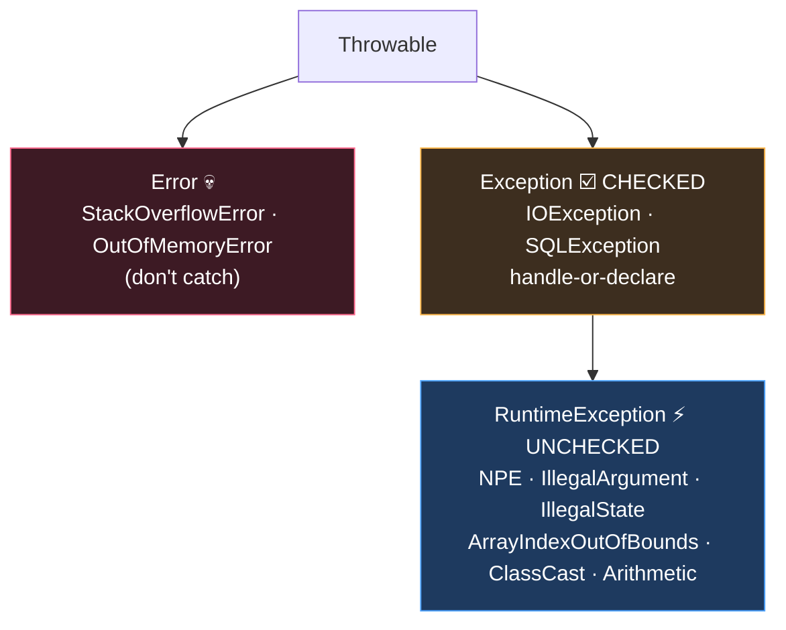

# Module 05 — Exceptions

## 1. Hierarchy (draw it from memory weekly)
```
Throwable
├── Error                      (unchecked)  e.g. OutOfMemoryError, StackOverflowError, ExceptionInInitializerError, NoClassDefFoundError
└── Exception                  (checked)    e.g. IOException, FileNotFoundException, SQLException, ParseException, InterruptedException
    └── RuntimeException       (unchecked)  e.g. NullPointerException, ArithmeticException, ClassCastException,
                                            ArrayIndexOutOfBoundsException, IllegalArgumentException (→ NumberFormatException),
                                            IllegalStateException, UnsupportedOperationException, DateTimeException, MissingResourceException
```
Mnemonic: **"RE and Error run free"** (unchecked). Checked = must catch or declare (`throws`).

## 2. try/catch/finally flow rules
- `try` needs `catch` and/or `finally` (try-with-resources may have neither).
- Catch order: child before parent, or unreachable catch → **compile error**.
- Catching a checked exception that CANNOT be thrown in the try → compile error (except `Exception`/`Throwable`, always allowed).
- `finally` ALWAYS runs (except `System.exit`).
- ⚠️ **`return` in finally** overrides try/catch returns AND swallows exceptions. `finally { return 3; }` wins over everything.
- ⚠️ Exception thrown in finally replaces any earlier exception.
- Value semantics: `try { return x; } finally { x = 99; }` returns the ORIGINAL x — return value is computed before finally runs.

## 3. Multi-catch
`catch (IOException | SQLException e)` — types must NOT be in a parent/child relationship (`IOException | Exception` ❌). Variable `e` is implicitly final.

## 4. try-with-resources
```java
try (var in = new FileInputStream("a"); var out = new FileOutputStream("b")) { ... }
```
- Resources must implement **`AutoCloseable`** (`close() throws Exception`); `Closeable` extends it (`close() throws IOException`).
- Closed in **REVERSE** declaration order, BEFORE catch/finally run.
- Resource variables are final/effectively final; you can also use an existing effectively-final variable: `try (existingRes) { }` ✅.
- **Suppressed exceptions:** exception in try = primary; exceptions from close() get attached via `getSuppressed()`. BUT if close() alone throws (try was fine), that IS the primary exception. Exception thrown in finally is NOT suppressed — it replaces.
- Resource scope = try block only (not visible in catch/finally).

## 5. Custom & throwing
- `throw` (verb, one exception object) vs `throws` (declaration).
- `throw null;` → NullPointerException. Code right after `throw` → unreachable → compile error.
- Overriding: may throw narrower/fewer checked, never broader/new checked; unchecked free (see Module 03).
- Common constructor forms: `Exception(String msg)`, `Exception(String msg, Throwable cause)`.

## ⚠️ Top traps
1. `catch (FileNotFoundException e)` AFTER `catch (IOException e)` → unreachable → compile error.
2. finally's return/throw silently discards try's result.
3. Resources close in reverse order — output-order questions.
4. Multi-catch with related types → compile error.
5. Catching checked exception never thrown in try → compile error (but `catch (Exception)` always ok).
6. `int[] a = new int[2]; a[2]` → ArrayIndexOutOfBoundsException (runtime, compiles fine).

---

## 🧠 Visual — the hierarchy & the climb

🎬 **Watch an exception climb the stack live:** [`interactive/java-internals-visualizer.html`](../../interactive/java-internals-visualizer.html) → tab 3.



Catch-order rule falls out of the picture: catch the LEAVES before the ROOT, or the later catch is unreachable (compile error).
