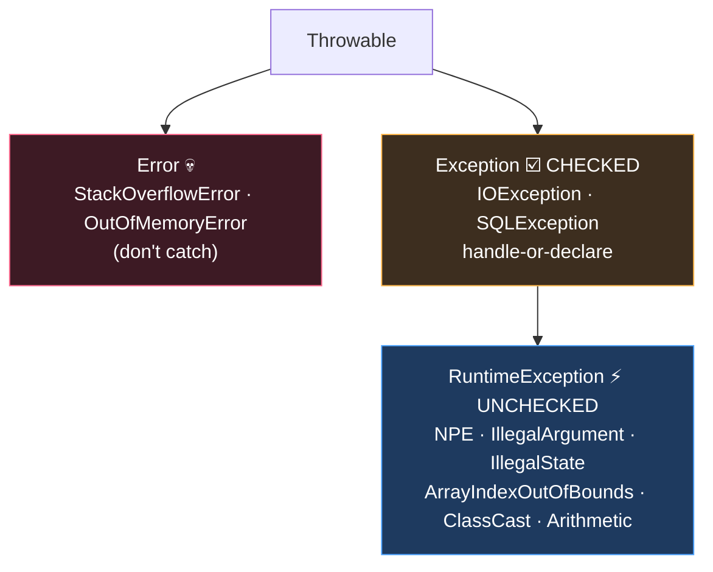

# Module 05 — Exceptions

## 1. Hierarchy (draw it from memory weekly)
```
Throwable
├── Error                      (unchecked)  e.g. OutOfMemoryError, StackOverflowError, ExceptionInInitializerError, NoClassDefFoundError
└── Exception                  (checked)    e.g. IOException, FileNotFoundException, SQLException, ParseException, InterruptedException
    └── RuntimeException       (unchecked)  e.g. NullPointerException, ArithmeticException, ClassCastException,
                                            ArrayIndexOutOfBoundsException, IllegalArgumentException (→ NumberFormatException),
                                            IllegalStateException, UnsupportedOperationException, DateTimeException, MissingResourceException
```
Mnemonic: **"RE and Error run free"** (unchecked). Checked = must catch or declare (`throws`).

## 2. try/catch/finally flow rules
- `try` needs `catch` and/or `finally` (try-with-resources may have neither).
- Catch order: child before parent, or unreachable catch → **compile error**.
- Catching a checked exception that CANNOT be thrown in the try → compile error (except `Exception`/`Throwable`, always allowed).
- `finally` ALWAYS runs (except `System.exit`).
- ⚠️ **`return` in finally** overrides try/catch returns AND swallows exceptions. `finally { return 3; }` wins over everything.
- ⚠️ Exception thrown in finally replaces any earlier exception.
- Value semantics: `try { return x; } finally { x = 99; }` returns the ORIGINAL x — return value is computed before finally runs.

## 3. Multi-catch
`catch (IOException | SQLException e)` — types must NOT be in a parent/child relationship (`IOException | Exception` ❌). Variable `e` is implicitly final.

## 4. try-with-resources
```java
try (var in = new FileInputStream("a"); var out = new FileOutputStream("b")) { ... }
```
- Resources must implement **`AutoCloseable`** (`close() throws Exception`); `Closeable` extends it (`close() throws IOException`).
- Closed in **REVERSE** declaration order, BEFORE catch/finally run.
- Resource variables are final/effectively final; you can also use an existing effectively-final variable: `try (existingRes) { }` ✅.
- **Suppressed exceptions:** exception in try = primary; exceptions from close() get attached via `getSuppressed()`. BUT if close() alone throws (try was fine), that IS the primary exception. Exception thrown in finally is NOT suppressed — it replaces.
- Resource scope = try block only (not visible in catch/finally).

## 5. Custom & throwing
- `throw` (verb, one exception object) vs `throws` (declaration).
- `throw null;` → NullPointerException. Code right after `throw` → unreachable → compile error.
- Overriding: may throw narrower/fewer checked, never broader/new checked; unchecked free (see Module 03).
- Common constructor forms: `Exception(String msg)`, `Exception(String msg, Throwable cause)`.

## ⚠️ Top traps
1. `catch (FileNotFoundException e)` AFTER `catch (IOException e)` → unreachable → compile error.
2. finally's return/throw silently discards try's result.
3. Resources close in reverse order — output-order questions.
4. Multi-catch with related types → compile error.
5. Catching checked exception never thrown in try → compile error (but `catch (Exception)` always ok).
6. `int[] a = new int[2]; a[2]` → ArrayIndexOutOfBoundsException (runtime, compiles fine).

---

## 🧠 Visual — the hierarchy & the climb

🎬 **Watch an exception climb the stack live:** [`interactive/java-internals-visualizer.html`](../../interactive/java-internals-visualizer.html) → tab 3.



Catch-order rule falls out of the picture: catch the LEAVES before the ROOT, or the later catch is unreachable (compile error).

---

## 🧭 The mental model — a second return channel

A method has two ways to hand control back to its caller. The normal one carries a value up **one frame at a time**. The other one — throwing — carries an *object* up **as many frames as it takes** until somebody catches it, destroying every frame it passes through on the way.

Everything else in this module falls out of that one picture:

- **Checked vs unchecked** is the compiler asking: "is this a failure the caller could plausibly recover from?" If yes, it forces the caller to acknowledge it. `IOException` — the disk might be full, you could retry. `NullPointerException` — you have a bug, no retry helps.
- **Catch ordering** matters because the unwind stops at the *first* matching catch. A broader catch listed first would swallow everything after it, so the compiler forbids it.
- **`finally` beats everything** because it is defined as "run this while the frame is being destroyed, whatever destroyed it." That is why a `return` in `finally` wins: the frame is already leaving, and `finally` gets the last word on how.
- **Suppression exists** because `try-with-resources` can produce *two* failures at once — yours and the one from `close()`. Java has to pick one to propagate, so it keeps yours and staples the other one on.

> If you can say **"who is unwinding, and who gets to interrupt the unwind"**, every question in this module answers itself.

## 🔬 Worked trace — how `finally` steals a return

This is the highest-yield trace in the module. Walk it slowly.

```java
int f() {
    int x = 1;
    try {
        return x;          // ①
    } finally {
        x = 99;            // ②
        // return x;       // ③ — if this line existed
    }
}
```

| Step | What the JVM does | State |
|---|---|---|
| ① | Evaluates `x` → `1`. **Copies that value to the return slot.** Does *not* leave yet. | return slot = `1`, `x` = `1` |
| ② | `finally` must run before the frame dies. Assigns `x = 99`. | return slot = `1`, `x` = `99` |
| — | `finally` ends without returning. Frame leaves with the stored slot. | **returns 1** |
| ③ | *If* `finally` had its own `return x`, it **overwrites the slot**. | **returns 99** |

The rule to memorise: **the return value is computed and stored before `finally` runs.** Mutating the variable afterwards changes the variable, not the already-captured value. Only a `return` *inside* `finally` can overwrite the slot — and if an exception was in flight, that same `return` silently discards it.

## 🔬 Worked trace — suppression, both directions

```java
class R implements AutoCloseable {
    private final String n;
    R(String n) { this.n = n; }
    public void close() { throw new IllegalStateException("close-" + n); }
}
```

**Case A — the try block also fails:**

```java
try (R a = new R("A")) {
    throw new RuntimeException("body");
}
```

1. `body` is thrown; the unwind begins.
2. Before any catch runs, `a.close()` is called. It throws `close-A`.
3. Java already has a primary exception, so `close-A` is **attached as suppressed**.
4. What escapes: `RuntimeException: body`, with `getSuppressed()[0]` = `close-A`.

**Case B — only `close()` fails:**

```java
try (R a = new R("A")) {
    // no exception here
}
```

1. The body completes normally. There is no primary exception.
2. `a.close()` throws `close-A`. With nothing to attach to, **it becomes the primary.**
3. What escapes: `IllegalStateException: close-A`, nothing suppressed.

The distinction the exam tests: *suppression only happens when something was already being thrown.*

## 🎭 Why the wrong answer looks right

| Tempting belief | Why it's tempting | The truth |
|---|---|---|
| "`finally` always runs" | It's what everyone is taught | `System.exit()`, a JVM crash, or an infinite loop in `try` all skip it |
| "`close()`'s exception is always suppressed" | Case A is the one people see | Only when a primary already exists — otherwise it *is* the primary |
| "An exception in `finally` gets suppressed too" | Symmetry with try-with-resources | No. It **replaces** the pending exception outright. Nothing is attached |
| "You can catch any exception you like" | `catch` looks unconditional | Catching a *checked* exception the `try` cannot throw is a compile error — but `Exception` and `Throwable` are always legal |
| "Resources close in declaration order" | Reading order feels natural | **Reverse** order, and before `catch`/`finally` |
| "Multi-catch works for any types" | The `|` looks like a plain or | Alternatives must be **disjoint** — `IOException \| Exception` won't compile |
| "`throw null` is a compile error" | It looks obviously wrong | It compiles. It throws `NullPointerException` at runtime |

## 🔁 Recall ladder — answer out loud, no scrolling

1. Name three things `Throwable` splits into, and which are checked.
2. Why is `catch (FileNotFoundException)` after `catch (IOException)` a *compile* error rather than dead code at runtime?
3. In what order do three declared resources close, and does that happen before or after `catch`?
4. Write the two-line body of a method that returns `1` even though `finally` sets the variable to `99`.
5. An exception is thrown in the body *and* in `close()`. Which one does the caller see, and how do they reach the other?
6. Same question, but the body succeeded. What changes?
7. Your override wants to throw `Exception` where the parent threw `IOException`. Legal? What about the reverse?
8. Give one situation where `finally` does not execute.

*Anything you couldn't answer cleanly is a flashcard, not a re-read.*
