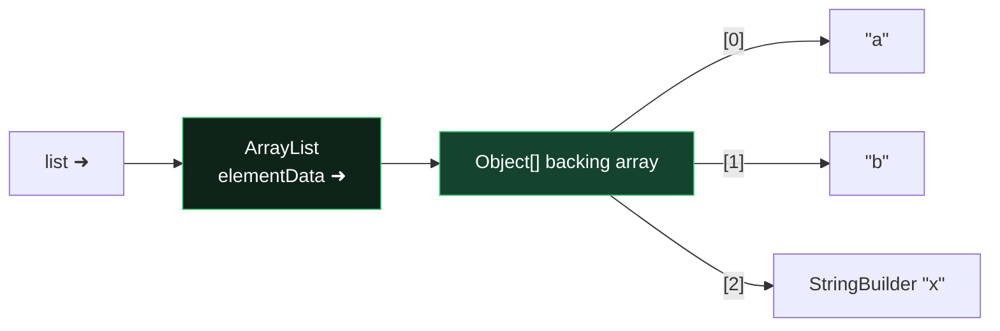

# Module 06 — Arrays, Collections, Generics

## 1. Arrays
- Declarations: `int[] a`, `int a[]`, `int[] b, c[]` → b is int[], c is int[][] (trap!).
- `new int[3]` zero-filled; `int[] a = {1,2};` only at declaration (`a = {1,2};` later ❌; use `new int[]{1,2}`).
- Covariant: `Object[] o = new String[2];` compiles, but `o[0] = 1;` 💥 `ArrayStoreException`.
- `Arrays.sort(a)`, `Arrays.binarySearch(a, key)` — array MUST be sorted; found → index; not found → `-(insertionPoint) - 1`.
- `Arrays.compare(a,b)`: 0 equal; first差 element decides; prefix → shorter is smaller (negative). `Arrays.mismatch(a,b)`: index of first difference, `-1` if identical.
- `a.length` (field!) vs `str.length()` vs `list.size()`.
- Multi-dim can be jagged: `int[][] m = new int[2][]; m[0] = new int[5];`.

## 2. Collections map (memorize the table)

| Interface | Impl | Ordered? | Sorted? | Dups? | Nulls? |
|-----------|------|----------|---------|-------|--------|
| List | ArrayList (fast get) / LinkedList (fast ends) | insertion | no | yes | yes |
| Set | HashSet | no | no | no | one null |
| Set | LinkedHashSet | insertion | no | no | one null |
| Set | TreeSet | — | YES (natural/Comparator) | no | ❌ NPE |
| Queue/Deque | ArrayDeque | FIFO/LIFO | no | yes | ❌ |
| Queue | PriorityQueue | by priority | heap | yes | ❌ |
| Map | HashMap | no | no | keys unique | 1 null key |
| Map | TreeMap | — | keys sorted | keys unique | ❌ null key |

- `List` extras: `add(i,e), set(i,e) (returns old), remove(int) vs remove(Object)` — ⚠️ `List<Integer> l; l.remove(1)` removes INDEX 1, `l.remove(Integer.valueOf(1))` removes value.
- **Immutable factories:** `List.of(...)`, `Set.of(...)`, `Map.of(k,v,...)`, `Map.ofEntries(entry(k,v)...)`, `List.copyOf(c)` → add/remove/set 💥 `UnsupportedOperationException`; nulls ❌ NPE; `Set.of(1,1)` / duplicate Map keys 💥 IllegalArgumentException.
- `Arrays.asList(arr)` — FIXED SIZE view: `set` ✅ (writes through to array), `add/remove` 💥.
- Deque: stack ops `push/pop/peek` (head); queue ops `offer/poll/peek` (tail-in head-out). `add/remove/element` throw on failure; `offer/poll/peek` return false/null.
- Map: `put` (returns previous or null), `putIfAbsent`, `getOrDefault`, `merge(k, v, biFn)` — if key absent or value null → puts v; else applies fn; fn returning null REMOVES the key. `computeIfAbsent/Present`, `forEach((k,v)->..)`, `keySet/values/entrySet`.
- Iterating while structurally modifying (except via Iterator.remove) 💥 `ConcurrentModificationException`.

## 3. Sorting: Comparable vs Comparator
- `Comparable<T>.compareTo(T)` — natural order, in the class itself. Contract: negative = this before other. Consistent-with-equals recommended.
- `Comparator<T>.compare(a,b)` — external. Building:
```java
Comparator<Person> c = Comparator.comparing(Person::lastName)
                                 .thenComparing(Person::age)
                                 .reversed();
Comparator.comparingInt(Person::age); Comparator.nullsFirst(c); c.naturalOrder();
```
- `Collections.sort(list)` requires Comparable elements else compile error; `list.sort(comparator)`; `Collections.binarySearch(list, key)` needs sorted list.
- TreeSet/TreeMap of non-Comparable elements without a Comparator: compiles, 💥 `ClassCastException` at runtime on first add of a second... actually on first `add`.

## 4. Generics
- Erasure: no `new T()`, `new T[]`, `T.class`, no primitives as type args, overloads differing only in type parameter ❌.
- Raw types compile with warnings — but mixing raw and generic causes runtime CCE surprises.
- **PECS — Producer Extends, Consumer Super:**
  - `List<? extends Number>` — read as Number ✅; `add(anything)` ❌ (except null).
  - `List<? super Integer>` — `add(Integer)` ✅; reads come out as Object.
  - `List<?>` — read Object, add nothing (null only).
- `List<Object> ≠ List<String>`: `List<Object> l = new ArrayList<String>();` ❌ (invariance). Arrays ARE covariant (contrast!).
- Generic method: `public static <T extends Comparable<T>> T max(List<T> l)` — type parameter declared before return type.
- Bounds: `<T extends Number & Comparable<T>>` — class first, then interfaces, `&` separator.

## ⚠️ Top traps
1. `list.remove(1)` vs `remove(Integer.valueOf(1))`.
2. `List.of` / `Arrays.asList` mutation exceptions (know WHICH ops fail on which).
3. binarySearch on unsorted data = undefined result (not an exception!).
4. TreeSet + null or non-comparable → runtime exceptions.
5. `List<? extends X>.add(...)` → compile error.
6. `int[] b, c[];` mixed declaration.

---

## 🧠 Memory View — collections hold arrows, never objects



Consequences the exam loves:
- **Shallow copies everywhere**: `new ArrayList<>(list)` copies ARROWS — both lists share the same elements. Mutate an element (e.g., that StringBuilder) → visible in both.
- `List.of(...)` builds an immutable *container* — but the elements it points to stay as mutable as ever.
- **2-D arrays** = array of arrows to row arrays → rows can be shared, jagged, or null.
- **Generics are erased at runtime**: the heap object is just `ArrayList`; `List<String>` vs `List<Integer>` is compile-time only — why `instanceof List<String>` won't compile, and why you can't `new T[]`.
