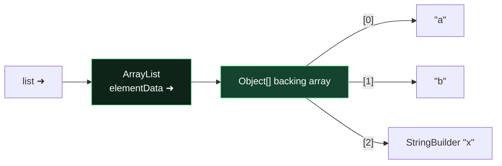

# Module 06 — Arrays, Collections, Generics

## 1. Arrays
- Declarations: `int[] a`, `int a[]`, `int[] b, c[]` → b is int[], c is int[][] (trap!).
- `new int[3]` zero-filled; `int[] a = {1,2};` only at declaration (`a = {1,2};` later ❌; use `new int[]{1,2}`).
- Covariant: `Object[] o = new String[2];` compiles, but `o[0] = 1;` 💥 `ArrayStoreException`.
- `Arrays.sort(a)`, `Arrays.binarySearch(a, key)` — array MUST be sorted; found → index; not found → `-(insertionPoint) - 1`.
- `Arrays.compare(a,b)`: 0 equal; first差 element decides; prefix → shorter is smaller (negative). `Arrays.mismatch(a,b)`: index of first difference, `-1` if identical.
- `a.length` (field!) vs `str.length()` vs `list.size()`.
- Multi-dim can be jagged: `int[][] m = new int[2][]; m[0] = new int[5];`.

## 2. Collections map (memorize the table)

| Interface | Impl | Ordered? | Sorted? | Dups? | Nulls? |
|-----------|------|----------|---------|-------|--------|
| List | ArrayList (fast get) / LinkedList (fast ends) | insertion | no | yes | yes |
| Set | HashSet | no | no | no | one null |
| Set | LinkedHashSet | insertion | no | no | one null |
| Set | TreeSet | — | YES (natural/Comparator) | no | ❌ NPE |
| Queue/Deque | ArrayDeque | FIFO/LIFO | no | yes | ❌ |
| Queue | PriorityQueue | by priority | heap | yes | ❌ |
| Map | HashMap | no | no | keys unique | 1 null key |
| Map | TreeMap | — | keys sorted | keys unique | ❌ null key |

- `List` extras: `add(i,e), set(i,e) (returns old), remove(int) vs remove(Object)` — ⚠️ `List<Integer> l; l.remove(1)` removes INDEX 1, `l.remove(Integer.valueOf(1))` removes value.
- **Immutable factories:** `List.of(...)`, `Set.of(...)`, `Map.of(k,v,...)`, `Map.ofEntries(entry(k,v)...)`, `List.copyOf(c)` → add/remove/set 💥 `UnsupportedOperationException`; nulls ❌ NPE; `Set.of(1,1)` / duplicate Map keys 💥 IllegalArgumentException.
- `Arrays.asList(arr)` — FIXED SIZE view: `set` ✅ (writes through to array), `add/remove` 💥.
- Deque: stack ops `push/pop/peek` (head); queue ops `offer/poll/peek` (tail-in head-out). `add/remove/element` throw on failure; `offer/poll/peek` return false/null.
- Map: `put` (returns previous or null), `putIfAbsent`, `getOrDefault`, `merge(k, v, biFn)` — if key absent or value null → puts v; else applies fn; fn returning null REMOVES the key. `computeIfAbsent/Present`, `forEach((k,v)->..)`, `keySet/values/entrySet`.
- Iterating while structurally modifying (except via Iterator.remove) 💥 `ConcurrentModificationException`.

## 3. Sorting: Comparable vs Comparator
- `Comparable<T>.compareTo(T)` — natural order, in the class itself. Contract: negative = this before other. Consistent-with-equals recommended.
- `Comparator<T>.compare(a,b)` — external. Building:
```java
Comparator<Person> c = Comparator.comparing(Person::lastName)
                                 .thenComparing(Person::age)
                                 .reversed();
Comparator.comparingInt(Person::age); Comparator.nullsFirst(c); c.naturalOrder();
```
- `Collections.sort(list)` requires Comparable elements else compile error; `list.sort(comparator)`; `Collections.binarySearch(list, key)` needs sorted list.
- TreeSet/TreeMap of non-Comparable elements without a Comparator: compiles, 💥 `ClassCastException` at runtime on first add of a second... actually on first `add`.

## 4. Generics
- Erasure: no `new T()`, `new T[]`, `T.class`, no primitives as type args, overloads differing only in type parameter ❌.
- Raw types compile with warnings — but mixing raw and generic causes runtime CCE surprises.
- **PECS — Producer Extends, Consumer Super:**
  - `List<? extends Number>` — read as Number ✅; `add(anything)` ❌ (except null).
  - `List<? super Integer>` — `add(Integer)` ✅; reads come out as Object.
  - `List<?>` — read Object, add nothing (null only).
- `List<Object> ≠ List<String>`: `List<Object> l = new ArrayList<String>();` ❌ (invariance). Arrays ARE covariant (contrast!).
- Generic method: `public static <T extends Comparable<T>> T max(List<T> l)` — type parameter declared before return type.
- Bounds: `<T extends Number & Comparable<T>>` — class first, then interfaces, `&` separator.

## ⚠️ Top traps
1. `list.remove(1)` vs `remove(Integer.valueOf(1))`.
2. `List.of` / `Arrays.asList` mutation exceptions (know WHICH ops fail on which).
3. binarySearch on unsorted data = undefined result (not an exception!).
4. TreeSet + null or non-comparable → runtime exceptions.
5. `List<? extends X>.add(...)` → compile error.
6. `int[] b, c[];` mixed declaration.

---

## 🧠 Memory View — collections hold arrows, never objects



Consequences the exam loves:
- **Shallow copies everywhere**: `new ArrayList<>(list)` copies ARROWS — both lists share the same elements. Mutate an element (e.g., that StringBuilder) → visible in both.
- `List.of(...)` builds an immutable *container* — but the elements it points to stay as mutable as ever.
- **2-D arrays** = array of arrows to row arrays → rows can be shared, jagged, or null.
- **Generics are erased at runtime**: the heap object is just `ArrayList`; `List<String>` vs `List<Integer>` is compile-time only — why `instanceof List<String>` won't compile, and why you can't `new T[]`.

---

## 🧭 The mental model — three questions pick every collection

You never memorise the Collections Framework. You *derive* it, by asking three questions in order:

1. **Does position matter?** Yes → `List`. No → `Set` (uniqueness) or `Map` (lookup by key).
2. **How do I find things again?** By hashing → `HashMap`/`HashSet` (O(1), no order). By comparing → `TreeMap`/`TreeSet` (O(log n), sorted). By insertion history → `LinkedHash*`.
3. **What will I do most?** Index reads → `ArrayList`. Ends-only inserts and removes → `ArrayDeque`. Middle inserts with a held cursor → `LinkedList` (rarer than people think).

Two contracts sit underneath all of it, and breaking either is where the exam lives:

- **Hashing requires agreement.** Equal objects must have equal hash codes. Override `equals` without `hashCode` and a `HashMap` will happily store two keys you consider identical, then fail to find either.
- **Sorting requires a total order.** `TreeSet`/`TreeMap` call `compareTo`/`compare` on every insert. No natural order and no supplied `Comparator` → `ClassCastException` at runtime, not compile time.

> **Hash needs `hashCode`; tree needs `compareTo`; list needs neither.** That one line predicts most failures.

## 🔬 Worked trace — the mutable key

The most instructive bug in the whole framework:

```java
var key = new StringBuilder("a");
var map = new HashMap<StringBuilder, String>();
map.put(key, "stored");

key.append("b");                  // the key object mutates in place

System.out.println(map.get(key)); // null
System.out.println(map.size());   // 1  — it's still in there
```

| Step | What happens |
|---|---|
| `put` | `hashCode()` of `"a"` → say bucket 7. Entry is filed in bucket 7 |
| `append` | The object is now `"ab"`. Its hash code changes. **The map is not notified** |
| `get` | Hashes `"ab"` → bucket 12. Looks in bucket 12. Finds nothing → `null` |

The entry is unreachable but still occupying space. This is exactly why keys should be immutable, and why `String` and records make such good keys. (`StringBuilder` compounds it by not overriding `equals` at all.)

## 🔬 Worked trace — the three flavours of "immutable"

They fail in different places, and the exam knows it.

```java
var a = List.of("x", "y");                              // truly immutable
var b = Arrays.asList("x", "y");                        // fixed-SIZE view over an array
var c = Collections.unmodifiableList(new ArrayList<>(List.of("x","y")));  // unmodifiable VIEW
```

| Operation | `List.of` | `Arrays.asList` | `unmodifiableList` |
|---|---|---|---|
| `set(0, "z")` | throws | **succeeds** — and writes through to the backing array | throws |
| `add("z")` | throws | throws (can't resize) | throws |
| Mutating the *original* list behind it | n/a | n/a | **visible through the view** |
| `null` elements | rejected | allowed | allowed |

`Arrays.asList` catches people twice: `set` works, and if you built it from an array, the array changes too.

## 🔬 Worked trace — PECS, and why it isn't arbitrary

```java
void copy(List<? super T> dst, List<? extends T> src)
```

- `src` is a **producer** — you take `T`s out of it. `? extends T` guarantees *everything inside is at least a `T`*, so reading is safe. But you can't write: the list might really be `List<Dog>` and you'd be inserting a `Cat`.
- `dst` is a **consumer** — you put `T`s into it. `? super T` guarantees *the list accepts at least `T`*, so writing is safe. But reading gives you only `Object`, because it might be `List<Animal>`.

**Producer Extends, Consumer Super.** Swap them and the compiler rejects exactly the operation you needed.

## 🎭 Why the wrong answer looks right

| Tempting belief | Why it's tempting | The truth |
|---|---|---|
| "`Arrays.asList` is immutable" | It refuses `add` | `set` works fine, and writes through to the backing array |
| "`HashMap` forbids nulls like `ConcurrentHashMap`" | They're both maps | `HashMap` allows **one** null key and many null values. `TreeMap` throws on a null key (it must compare it); `ConcurrentHashMap` forbids both |
| "`remove` and `poll` are synonyms" | Both remove | On an empty queue: `remove` **throws**, `poll` returns `null`. Same split as `add`/`offer`, `element`/`peek` |
| "`List<String>` is a `List<Object>`" | `String` is an `Object` | Generics are **invariant**. Allowing it would let you insert an `Integer` into a `List<String>` |
| "You can do `new T[10]`" | It reads naturally | Erasure removes `T` at runtime. Cast `(T[]) new Object[10]` and accept the warning |
| "`binarySearch` on unsorted input throws" | Bad input should fail loudly | It returns a **meaningless number**. Silently wrong is worse than an exception |
| "Overriding `equals` is enough" | Equality is what sets compare | Without `hashCode`, hash-based collections break. Records generate both for you |
| "Removing during a for-each is fine if it's the last element" | It sometimes appears to work | Undefined. Use `Iterator.remove()` or `removeIf()` |

## 🔁 Recall ladder

1. Three questions that pick a collection — say them in order.
2. Which collections accept a null key? Which reject it, and why does each reject it?
3. Empty queue: what do `remove`, `poll`, `element`, `peek` each do?
4. Fill in the 3×2 table for `set` and `add` across the three "immutable" list flavours.
5. Why does mutating a key after `put` lose the entry, and why does `size()` still count it?
6. Which wildcard lets you add? Which lets you read as `T`? Say the mnemonic.
7. Name three things erasure forbids.
8. What breaks if you override `equals` but not `hashCode` — and at what point does it break?
9. `ArrayDeque` as a stack versus as a queue: which methods, and which element comes out first?
10. When is `LinkedList` genuinely the right answer?
