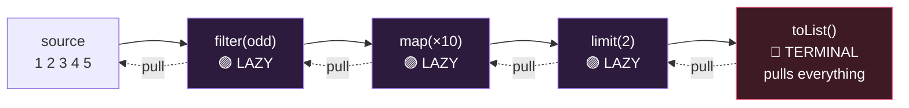

# Module 07 — Lambdas, Streams & Gatherers (biggest topic on the exam)

## 1. Functional interfaces (exactly ONE abstract method; @FunctionalInterface optional)

| Interface | Method | Signature |
|-----------|--------|-----------|
| Supplier<T> | get | () → T |
| Consumer<T> / BiConsumer<T,U> | accept | T → void |
| Predicate<T> / BiPredicate | test | T → boolean |
| Function<T,R> / BiFunction<T,U,R> | apply | T → R |
| UnaryOperator<T> / BinaryOperator<T> | apply | T→T / (T,T)→T |
| Runnable | run | () → void |
| Callable<V> | call | () → V, throws Exception |
| Comparator<T> | compare | (T,T) → int |

Primitive flavors: `IntSupplier, IntPredicate, IntFunction<R>, ToIntFunction<T>, IntBinaryOperator...`
Composition: `p1.and(p2).or(p3).negate()`, `f1.andThen(f2)` (f1 first), `f1.compose(f2)` (f2 first), `c1.andThen(c2)`.

- Lambda params: all typed, all `var`, or all inferred — no mixing (`(var x, y) ->` ❌).
- Lambdas capture only **effectively final** locals (fields are fine).
- A method that Object already has (`equals`) doesn't count as the abstract method.

**Method references, 4 kinds:**
1. static: `Integer::parseInt` = `s -> Integer.parseInt(s)`
2. bound instance: `str::startsWith` = `x -> str.startsWith(x)`
3. UNBOUND instance: `String::isEmpty` = `s -> s.isEmpty()`; `String::startsWith` = `(s, p) -> s.startsWith(p)` (first arg becomes receiver!)
4. constructor: `ArrayList::new`

## 2. Stream fundamentals
- Creation: `Stream.of(...)`, `list.stream()`, `Arrays.stream(arr)`, `Stream.generate(sup)` (infinite), `Stream.iterate(seed, f)` / `iterate(seed, pred, f)` (3-arg = finite), `Stream.empty()`, `IntStream.range(0,5)` (0..4) vs `rangeClosed(0,5)` (0..5).
- **Lazy:** nothing runs until a terminal operation. ⚠️ Streams are ONE-SHOT — second terminal op 💥 `IllegalStateException`.
- Intermediate: `filter map flatMap mapMulti distinct sorted peek limit skip takeWhile dropWhile boxed mapToInt/Obj gather`.
  - `takeWhile` stops at first failure; `dropWhile` drops until first failure (ordered semantics).
- Terminal: `forEach count min max findFirst findAny anyMatch allMatch noneMatch reduce collect toList toArray sum average` (primitives).
  - Reductions returning Optional: `min, max, findFirst, findAny, reduce(accumulator)`.
  - `reduce(identity, accumulator)` → T; `reduce(identity, accumulator, combiner)` for parallel/type-changing.
  - `stream.toList()` returns an UNMODIFIABLE list (vs `collect(Collectors.toList())` historically modifiable).
  - ⚠️ `allMatch` on EMPTY stream → true (vacuous truth); `anyMatch` → false.

## 3. Optional
- `Optional.of(x)` (💥 NPE if null), `ofNullable`, `empty`.
- `get()` 💥 NoSuchElementException if empty — prefer `orElse(v)`, `orElseGet(sup)`, `orElseThrow()`, `orElseThrow(sup)`.
- `isPresent, isEmpty, ifPresent(cons), ifPresentOrElse(cons, run), map, filter, flatMap, or(sup)`.
- ⚠️ `orElse(compute())` ALWAYS evaluates compute(); `orElseGet` only when empty.

## 4. Collectors (memorize signatures)
- `toList, toSet, toUnmodifiableList, toMap(keyFn, valFn)` — duplicate keys 💥 IllegalStateException unless merge fn: `toMap(k, v, (a,b)->a)`, 4th arg supplier `TreeMap::new`.
- `joining(", ", "[", "]")`, `counting()`, `summingInt`, `averagingDouble`, `minBy/maxBy(cmp)`, `mapping(fn, downstream)`.
- `groupingBy(classifier)` → `Map<K, List<T>>`; `groupingBy(cl, downstream)`; `groupingBy(cl, TreeMap::new, downstream)`.
- `partitioningBy(pred)` → `Map<Boolean, List<T>>` — ALWAYS has both true & false keys (maybe empty lists).
- `teeing(c1, c2, merger)` — two collectors, merged result.

## 5. Stream Gatherers (Java 24 — NEW on this exam!)
`gather(Gatherer)` = custom INTERMEDIATE operations. Built-ins in `java.util.stream.Gatherers`:
```java
Stream.of(1,2,3,4,5).gather(Gatherers.windowFixed(2)).toList();   // [[1,2],[3,4],[5]]
Stream.of(1,2,3,4).gather(Gatherers.windowSliding(2)).toList();   // [[1,2],[2,3],[3,4]]
Stream.of(1,2,3).gather(Gatherers.fold(() -> 0, Integer::sum)).toList();  // [6]  (one element!)
Stream.of(1,2,3).gather(Gatherers.scan(() -> 0, Integer::sum)).toList();  // [1,3,6] (running totals)
stream.gather(Gatherers.mapConcurrent(4, fn))                     // concurrent map, max 4 at once, order preserved
```
- fold → intermediate op producing a 1-element stream; scan → emits each intermediate result.
- A Gatherer has: initializer, integrator, combiner (parallel), finisher. `Gatherer.of(...)`, `Gatherer.ofSequential(...)`.

## 6. Parallel streams
- `list.parallelStream()` / `stream.parallel()`. `forEach` order NOT guaranteed; `forEachOrdered` restores order (kills perf).
- `findAny` truly any; `findFirst` respects order. reduce needs associative accumulator + identity that is truly identity.
- Never mutate shared state in a parallel pipeline (use collectors instead).

## ⚠️ Top traps
1. Reusing a consumed stream → IllegalStateException.
2. No terminal op → NOTHING happens (peek/print never runs).
3. `sorted()` on infinite stream → hangs; `limit` BEFORE sorted on infinite streams.
4. `toMap` duplicate keys → IllegalStateException.
5. `Optional.get` on empty; `of(null)`.
6. Unbound method ref arity: `String::concat` is `(a,b) -> a.concat(b)`.
7. fold vs scan vs reduce: fold/scan are gatherers (intermediate), reduce is terminal.

---

## 🧠 Visual — the pipeline & laziness

🎬 **Watch elements flow one-by-one (and limit() short-circuit the source):** [`interactive/java-internals-visualizer.html`](../../interactive/java-internals-visualizer.html) → tab 2.



The terminal op PULLS; intermediates do nothing until then. Element journey is depth-first: 1 goes source→filter→map→collect *before* 2 is even read — which is why `limit` can stop the source early and why `peek` output interleaves.
