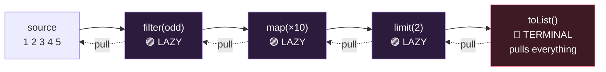

# Module 07 — Lambdas, Streams & Gatherers (biggest topic on the exam)

## 1. Functional interfaces (exactly ONE abstract method; @FunctionalInterface optional)

| Interface | Method | Signature |
|-----------|--------|-----------|
| Supplier<T> | get | () → T |
| Consumer<T> / BiConsumer<T,U> | accept | T → void |
| Predicate<T> / BiPredicate | test | T → boolean |
| Function<T,R> / BiFunction<T,U,R> | apply | T → R |
| UnaryOperator<T> / BinaryOperator<T> | apply | T→T / (T,T)→T |
| Runnable | run | () → void |
| Callable<V> | call | () → V, throws Exception |
| Comparator<T> | compare | (T,T) → int |

Primitive flavors: `IntSupplier, IntPredicate, IntFunction<R>, ToIntFunction<T>, IntBinaryOperator...`
Composition: `p1.and(p2).or(p3).negate()`, `f1.andThen(f2)` (f1 first), `f1.compose(f2)` (f2 first), `c1.andThen(c2)`.

- Lambda params: all typed, all `var`, or all inferred — no mixing (`(var x, y) ->` ❌).
- Lambdas capture only **effectively final** locals (fields are fine).
- A method that Object already has (`equals`) doesn't count as the abstract method.

**Method references, 4 kinds:**
1. static: `Integer::parseInt` = `s -> Integer.parseInt(s)`
2. bound instance: `str::startsWith` = `x -> str.startsWith(x)`
3. UNBOUND instance: `String::isEmpty` = `s -> s.isEmpty()`; `String::startsWith` = `(s, p) -> s.startsWith(p)` (first arg becomes receiver!)
4. constructor: `ArrayList::new`

## 2. Stream fundamentals
- Creation: `Stream.of(...)`, `list.stream()`, `Arrays.stream(arr)`, `Stream.generate(sup)` (infinite), `Stream.iterate(seed, f)` / `iterate(seed, pred, f)` (3-arg = finite), `Stream.empty()`, `IntStream.range(0,5)` (0..4) vs `rangeClosed(0,5)` (0..5).
- **Lazy:** nothing runs until a terminal operation. ⚠️ Streams are ONE-SHOT — second terminal op 💥 `IllegalStateException`.
- Intermediate: `filter map flatMap mapMulti distinct sorted peek limit skip takeWhile dropWhile boxed mapToInt/Obj gather`.
  - `takeWhile` stops at first failure; `dropWhile` drops until first failure (ordered semantics).
- Terminal: `forEach count min max findFirst findAny anyMatch allMatch noneMatch reduce collect toList toArray sum average` (primitives).
  - Reductions returning Optional: `min, max, findFirst, findAny, reduce(accumulator)`.
  - `reduce(identity, accumulator)` → T; `reduce(identity, accumulator, combiner)` for parallel/type-changing.
  - `stream.toList()` returns an UNMODIFIABLE list (vs `collect(Collectors.toList())` historically modifiable).
  - ⚠️ `allMatch` on EMPTY stream → true (vacuous truth); `anyMatch` → false.

## 3. Optional
- `Optional.of(x)` (💥 NPE if null), `ofNullable`, `empty`.
- `get()` 💥 NoSuchElementException if empty — prefer `orElse(v)`, `orElseGet(sup)`, `orElseThrow()`, `orElseThrow(sup)`.
- `isPresent, isEmpty, ifPresent(cons), ifPresentOrElse(cons, run), map, filter, flatMap, or(sup)`.
- ⚠️ `orElse(compute())` ALWAYS evaluates compute(); `orElseGet` only when empty.

## 4. Collectors (memorize signatures)
- `toList, toSet, toUnmodifiableList, toMap(keyFn, valFn)` — duplicate keys 💥 IllegalStateException unless merge fn: `toMap(k, v, (a,b)->a)`, 4th arg supplier `TreeMap::new`.
- `joining(", ", "[", "]")`, `counting()`, `summingInt`, `averagingDouble`, `minBy/maxBy(cmp)`, `mapping(fn, downstream)`.
- `groupingBy(classifier)` → `Map<K, List<T>>`; `groupingBy(cl, downstream)`; `groupingBy(cl, TreeMap::new, downstream)`.
- `partitioningBy(pred)` → `Map<Boolean, List<T>>` — ALWAYS has both true & false keys (maybe empty lists).
- `teeing(c1, c2, merger)` — two collectors, merged result.

## 5. Stream Gatherers (Java 24 — NEW on this exam!)
`gather(Gatherer)` = custom INTERMEDIATE operations. Built-ins in `java.util.stream.Gatherers`:
```java
Stream.of(1,2,3,4,5).gather(Gatherers.windowFixed(2)).toList();   // [[1,2],[3,4],[5]]
Stream.of(1,2,3,4).gather(Gatherers.windowSliding(2)).toList();   // [[1,2],[2,3],[3,4]]
Stream.of(1,2,3).gather(Gatherers.fold(() -> 0, Integer::sum)).toList();  // [6]  (one element!)
Stream.of(1,2,3).gather(Gatherers.scan(() -> 0, Integer::sum)).toList();  // [1,3,6] (running totals)
stream.gather(Gatherers.mapConcurrent(4, fn))                     // concurrent map, max 4 at once, order preserved
```
- fold → intermediate op producing a 1-element stream; scan → emits each intermediate result.
- A Gatherer has: initializer, integrator, combiner (parallel), finisher. `Gatherer.of(...)`, `Gatherer.ofSequential(...)`.

## 6. Parallel streams
- `list.parallelStream()` / `stream.parallel()`. `forEach` order NOT guaranteed; `forEachOrdered` restores order (kills perf).
- `findAny` truly any; `findFirst` respects order. reduce needs associative accumulator + identity that is truly identity.
- Never mutate shared state in a parallel pipeline (use collectors instead).

## ⚠️ Top traps
1. Reusing a consumed stream → IllegalStateException.
2. No terminal op → NOTHING happens (peek/print never runs).
3. `sorted()` on infinite stream → hangs; `limit` BEFORE sorted on infinite streams.
4. `toMap` duplicate keys → IllegalStateException.
5. `Optional.get` on empty; `of(null)`.
6. Unbound method ref arity: `String::concat` is `(a,b) -> a.concat(b)`.
7. fold vs scan vs reduce: fold/scan are gatherers (intermediate), reduce is terminal.

---

## 🧠 Visual — the pipeline & laziness

🎬 **Watch elements flow one-by-one (and limit() short-circuit the source):** [`interactive/java-internals-visualizer.html`](../../interactive/java-internals-visualizer.html) → tab 2.



The terminal op PULLS; intermediates do nothing until then. Element journey is depth-first: 1 goes source→filter→map→collect *before* 2 is even read — which is why `limit` can stop the source early and why `peek` output interleaves.

---

## 🧭 The mental model — a stream is a plan, not a collection

The single most useful sentence in this module: **a stream holds no elements.** It is a *plan* for pulling elements from a source, one at a time, through a chain of operations.

Intermediate operations don't process anything — they append a step to the plan and hand you a new stream. The terminal operation is what finally says "go", and then it **pulls**. The source doesn't push elements forward; the terminal drags them through.

That one reversal explains almost everything people find surprising:

- **Nothing happens without a terminal op** — you built a plan and never ran it.
- **Elements travel depth-first.** Element 1 goes source → filter → map → collector *before* element 2 is even read. That's why `peek` output interleaves instead of printing in stage order.
- **`limit(2)` can stop the source.** Because the terminal is pulling, once it has two elements it simply stops pulling. An infinite source is fine.
- **`sorted()` on an infinite stream hangs.** Sorting cannot emit its first element until it has seen the last one, so it pulls forever.
- **Streams are one-shot.** The plan carries a cursor into the source. Once drained, re-running it would produce nothing meaningful, so Java throws rather than lie to you.

> Say it as: **the terminal pulls, the intermediates are lazy, and every element makes the whole journey alone.**

## 🔬 Worked trace — the element journey

```java
Stream.of(1, 2, 3, 4, 5)
      .peek(n  -> System.out.println("  src  " + n))
      .filter(n -> n % 2 == 1)
      .peek(n  -> System.out.println("  kept " + n))
      .map(n   -> n * 10)
      .limit(2)
      .forEach(n -> System.out.println("OUT   " + n));
```

Predict the output before reading on.

```
  src  1
  kept 1
OUT   10
  src  2          ← fails the filter, journey ends here
  src  3
  kept 3
OUT   30          ← limit is now satisfied; the source is never read again
```

`4` and `5` are **never touched**. If you expected all five "src" lines first and then the outputs, you were imagining stage-by-stage batch processing — that's the model to unlearn.

## 🔬 Worked trace — `orElse` versus `orElseGet`

```java
String expensive() { System.out.println("  computing…"); return "fallback"; }

Optional.of("value").orElse(expensive());        // prints "computing…", returns "value"
Optional.of("value").orElseGet(this::expensive); // prints nothing,      returns "value"
```

`orElse` takes a **value**. Java evaluates arguments before the call, so `expensive()` runs no matter what — its result is then thrown away. `orElseGet` takes a **Supplier**, which is only invoked when the Optional is empty.

Harmless with a string literal. A live bug when the fallback hits a database.

## 🔬 Worked trace — `fold` vs `scan` vs `reduce`

Same inputs, three different shapes of answer:

```java
var in = Stream.of(1, 2, 3);

in.reduce(0, Integer::sum)                          // → 6          a value; TERMINAL
Stream.of(1,2,3).gather(Gatherers.fold(() -> 0, Integer::sum)).toList()  // → [6]        one-element STREAM; intermediate
Stream.of(1,2,3).gather(Gatherers.scan(() -> 0, Integer::sum)).toList()  // → [1, 3, 6]  every running total; intermediate
```

The exam probes two things here: **which are intermediate** (both gatherers — you can keep chaining after them) and **how many elements come out** (`fold` collapses to one, `scan` emits one per input).

## 🎭 Why the wrong answer looks right

| Tempting belief | Why it's tempting | The truth |
|---|---|---|
| "`peek` always prints" | It's a debugging tool, so surely it runs | Since Java 9, `count()` may skip the pipeline entirely when the size is already known. Use `forEach` when you need the side effect |
| "`filter` then `takeWhile` are similar" | Both drop elements | `filter` tests every element; `takeWhile` **stops permanently** at the first failure. On `[1,2,5,1]` with `< 3`: filter → `[1,2,1]`, takeWhile → `[1,2]` |
| "`allMatch` on an empty stream is false" | Nothing matched, so false feels right | **`true`** — vacuous truth. No element exists to violate the predicate. `anyMatch` is `false` |
| "`Collectors.toList()` and `toList()` are the same" | Nearly identical names | `Stream.toList()` is **unmodifiable**; `Collectors.toList()` gives a mutable `ArrayList` |
| "`partitioningBy` may return one key" | If nothing matches, why keep the key? | Always **exactly two** — `true` and `false` — possibly mapping to empty lists |
| "`groupingBy` behaves the same" | It's the neighbouring method | It only creates keys that actually occur |
| "`Optional.of(null)` gives empty" | It's the obvious null-handling | **NPE.** `ofNullable` is the one that tolerates null |
| "Parallel makes it faster" | More threads, more speed | Splitting, boxing and merging cost real time. Small streams get *slower*, and non-associative reductions get *wrong* |
| "`String::concat` takes one argument" | It looks like a one-arg method | Unbound reference: `(a, b) -> a.concat(b)`. The receiver becomes the **first** parameter |

## 🔁 Recall ladder

1. What does a stream actually contain?
2. `Stream.of(1,2,3).filter(x -> x > 1);` — what runs?
3. Trace which elements are read for `.limit(1)` on a five-element source with a filter in the middle.
4. Why does `sorted()` hang on `Stream.generate(...)` but `limit(10).sorted()` doesn't?
5. Give the three arities of `reduce` and say when you need the third.
6. `[1,2,5,1]` with predicate `< 3` — output for `filter`, `takeWhile`, `dropWhile`.
7. `Gatherers.fold` on `[1,2,3]` — how many elements come out? And `scan`?
8. Name the four kinds of method reference and write a lambda equal to each.
9. When does `orElse` cost you something `orElseGet` wouldn't?
10. Two strings of the same length into `Collectors.toMap(String::length, s -> s)` — what happens, and the three ways to fix it?

*Anything hesitant is a flashcard.*
