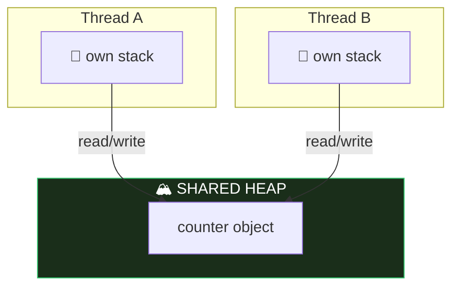

# Module 08 — Concurrency, Virtual Threads, Scoped Values

## 1. Threads basics
- Create: `new Thread(runnable).start()` — ⚠️ `run()` executes on the CURRENT thread (no new thread!). Calling `start()` twice 💥 IllegalThreadStateException.
- States: NEW → RUNNABLE → (BLOCKED / WAITING / TIMED_WAITING) → TERMINATED.
- `Thread.sleep(ms)` and `join()` throw checked `InterruptedException`. `interrupt()` sets a flag; sleeping/waiting threads wake with InterruptedException (which CLEARS the flag).
- Daemon threads don't keep the JVM alive (`setDaemon(true)` BEFORE start).

## 2. Virtual threads (Java 21+, pinning FIXED in Java 24)
```java
Thread v = Thread.ofVirtual().name("v1").start(task);
Thread p = Thread.ofPlatform().start(task);
Thread.startVirtualThread(task);
var exec = Executors.newVirtualThreadPerTaskExecutor();
```
- Virtual threads: cheap (millions OK), ALWAYS daemon (`setDaemon(false)` 💥), default priority fixed, carried by platform threads.
- Designed for BLOCKING I/O workloads, not CPU-bound.
- **Java 24 (JEP 491):** `synchronized` blocks no longer PIN virtual threads — a virtual thread blocking inside synchronized now releases its carrier. (Old advice "replace synchronized with ReentrantLock" is obsolete — exam may test this!)
- `thread.isVirtual()`.

## 3. ExecutorService & Futures
- `Executors.newFixedThreadPool(n), newCachedThreadPool(), newSingleThreadExecutor(), newScheduledThreadPool(n), newVirtualThreadPerTaskExecutor()`.
- `submit(Runnable)` → `Future<?>` (get() → null); `submit(Callable<T>)` → `Future<T>`.
- `future.get()` blocks; `get(timeout, unit)` 💥 TimeoutException; exceptions inside task surface as `ExecutionException`.
- Shut down or leak: `shutdown()` (no new tasks, finishes queued), `shutdownNow()` (attempts interrupt, returns unstarted tasks), `close()` (AutoCloseable — waits, since 19: usable in try-with-resources).
- `invokeAll(collection)` waits for all; `invokeAny` returns first success, cancels rest.
- ScheduledExecutorService: `schedule(task, delay, unit)`, `scheduleAtFixedRate(task, initial, period, unit)` (fixed clock rate), `scheduleWithFixedDelay` (delay AFTER completion).

## 4. Synchronization & atomics
- Race condition: `count++` is read-modify-write, NOT atomic.
- `synchronized` method (lock = this; static method locks the Class object) / block `synchronized(obj) {}`. Reentrant.
- `ReentrantLock`: `lock()` / `unlock()` in finally! `tryLock()`, `tryLock(time, unit)` → boolean, `lockInterruptibly()`. Unlocking a lock you don't hold 💥 IllegalMonitorStateException.
- Atomics: `AtomicInteger/Long/Boolean/Reference` — `incrementAndGet` (++x) vs `getAndIncrement` (x++), `addAndGet, compareAndSet, set, get`.
- `CyclicBarrier(n, action)` — await() until n threads arrive; reusable.
- `CountDownLatch(n)` — countDown()/await(); one-shot.

## 5. Concurrent collections
- `ConcurrentHashMap` (no null keys/values!), `CopyOnWriteArrayList` (snapshot iterators — no CME, writes copy the array), `ConcurrentLinkedQueue`, `LinkedBlockingQueue` (`put/take` block; `offer/poll` with timeout).
- `Collections.synchronizedList(list)` — synchronized wrappers, but iteration still needs manual sync; CME possible.

## 6. Scoped Values (Java 25 FINAL — JEP 506) ⭐
Immutable per-thread data sharing, the modern ThreadLocal replacement:
```java
static final ScopedValue<String> USER = ScopedValue.newInstance();

ScopedValue.where(USER, "yassin").run(() -> {
    IO.println(USER.get());          // "yassin" — visible here and in callees
});
// outside: USER.get() 💥 NoSuchElementException; USER.isBound() → false
```
- Bound only for the dynamic scope of run/call; rebinding inside nests (inner value wins, restored after).
- Immutable (no set!), automatically inherited by child threads in a StructuredTaskScope, far cheaper than ThreadLocal.
- `ScopedValue.where(K, v).call(() -> result)` for value-returning; `orElse(default)`.

## 7. ThreadLocal (contrast)
`ThreadLocal.withInitial(() -> v)`, `get/set/remove` — mutable, per-thread, risk of leaks in pools. Exam: know why ScopedValue is preferred.

## ⚠️ Top traps
1. `run()` vs `start()`.
2. Future.get() without shutdown → program hangs / or forgetting get → exceptions invisible.
3. `unlock()` not in finally; unlocking without holding.
4. ConcurrentHashMap nulls 💥 NPE.
5. AtomicInteger getAndIncrement vs incrementAndGet return values.
6. ScopedValue.get() outside a binding → NoSuchElementException.
7. Virtual threads: always daemon, don't pool them.

---

## 🧠 Memory View — threads share the heap, own their stacks



Every data race in existence is this picture: two stacks, one heap object, no coordination. `synchronized`/locks serialize access; `volatile` fixes *visibility*; `AtomicInteger` makes read-modify-write one indivisible step; **ScopedValue/ThreadLocal** work by giving each thread its own slot instead of sharing.

**Virtual threads:** thousands of cheap stacks stored ON THE HEAP, mounted onto a few carrier (platform) threads. Blocking? The JVM unmounts the virtual thread and reuses the carrier — that's why they're perfect for I/O-bound work, and (since JEP 491 / Java 24) blocking inside `synchronized` no longer pins the carrier.
