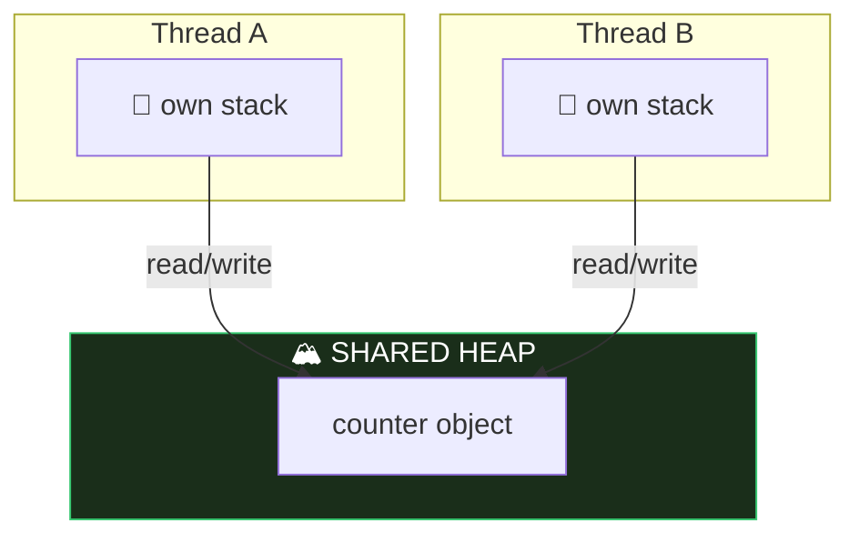

# Module 08 — Concurrency, Virtual Threads, Scoped Values

## 1. Threads basics
- Create: `new Thread(runnable).start()` — ⚠️ `run()` executes on the CURRENT thread (no new thread!). Calling `start()` twice 💥 IllegalThreadStateException.
- States: NEW → RUNNABLE → (BLOCKED / WAITING / TIMED_WAITING) → TERMINATED.
- `Thread.sleep(ms)` and `join()` throw checked `InterruptedException`. `interrupt()` sets a flag; sleeping/waiting threads wake with InterruptedException (which CLEARS the flag).
- Daemon threads don't keep the JVM alive (`setDaemon(true)` BEFORE start).

## 2. Virtual threads (Java 21+, pinning FIXED in Java 24)
```java
Thread v = Thread.ofVirtual().name("v1").start(task);
Thread p = Thread.ofPlatform().start(task);
Thread.startVirtualThread(task);
var exec = Executors.newVirtualThreadPerTaskExecutor();
```
- Virtual threads: cheap (millions OK), ALWAYS daemon (`setDaemon(false)` 💥), default priority fixed, carried by platform threads.
- Designed for BLOCKING I/O workloads, not CPU-bound.
- **Java 24 (JEP 491):** `synchronized` blocks no longer PIN virtual threads — a virtual thread blocking inside synchronized now releases its carrier. (Old advice "replace synchronized with ReentrantLock" is obsolete — exam may test this!)
- `thread.isVirtual()`.

## 3. ExecutorService & Futures
- `Executors.newFixedThreadPool(n), newCachedThreadPool(), newSingleThreadExecutor(), newScheduledThreadPool(n), newVirtualThreadPerTaskExecutor()`.
- `submit(Runnable)` → `Future<?>` (get() → null); `submit(Callable<T>)` → `Future<T>`.
- `future.get()` blocks; `get(timeout, unit)` 💥 TimeoutException; exceptions inside task surface as `ExecutionException`.
- Shut down or leak: `shutdown()` (no new tasks, finishes queued), `shutdownNow()` (attempts interrupt, returns unstarted tasks), `close()` (AutoCloseable — waits, since 19: usable in try-with-resources).
- `invokeAll(collection)` waits for all; `invokeAny` returns first success, cancels rest.
- ScheduledExecutorService: `schedule(task, delay, unit)`, `scheduleAtFixedRate(task, initial, period, unit)` (fixed clock rate), `scheduleWithFixedDelay` (delay AFTER completion).

## 4. Synchronization & atomics
- Race condition: `count++` is read-modify-write, NOT atomic.
- `synchronized` method (lock = this; static method locks the Class object) / block `synchronized(obj) {}`. Reentrant.
- `ReentrantLock`: `lock()` / `unlock()` in finally! `tryLock()`, `tryLock(time, unit)` → boolean, `lockInterruptibly()`. Unlocking a lock you don't hold 💥 IllegalMonitorStateException.
- Atomics: `AtomicInteger/Long/Boolean/Reference` — `incrementAndGet` (++x) vs `getAndIncrement` (x++), `addAndGet, compareAndSet, set, get`.
- `CyclicBarrier(n, action)` — await() until n threads arrive; reusable.
- `CountDownLatch(n)` — countDown()/await(); one-shot.

## 5. Concurrent collections
- `ConcurrentHashMap` (no null keys/values!), `CopyOnWriteArrayList` (snapshot iterators — no CME, writes copy the array), `ConcurrentLinkedQueue`, `LinkedBlockingQueue` (`put/take` block; `offer/poll` with timeout).
- `Collections.synchronizedList(list)` — synchronized wrappers, but iteration still needs manual sync; CME possible.

## 6. Scoped Values (Java 25 FINAL — JEP 506) ⭐
Immutable per-thread data sharing, the modern ThreadLocal replacement:
```java
static final ScopedValue<String> USER = ScopedValue.newInstance();

ScopedValue.where(USER, "yassin").run(() -> {
    IO.println(USER.get());          // "yassin" — visible here and in callees
});
// outside: USER.get() 💥 NoSuchElementException; USER.isBound() → false
```
- Bound only for the dynamic scope of run/call; rebinding inside nests (inner value wins, restored after).
- Immutable (no set!), automatically inherited by child threads in a StructuredTaskScope, far cheaper than ThreadLocal.
- `ScopedValue.where(K, v).call(() -> result)` for value-returning; `orElse(default)`.

## 7. ThreadLocal (contrast)
`ThreadLocal.withInitial(() -> v)`, `get/set/remove` — mutable, per-thread, risk of leaks in pools. Exam: know why ScopedValue is preferred.

## ⚠️ Top traps
1. `run()` vs `start()`.
2. Future.get() without shutdown → program hangs / or forgetting get → exceptions invisible.
3. `unlock()` not in finally; unlocking without holding.
4. ConcurrentHashMap nulls 💥 NPE.
5. AtomicInteger getAndIncrement vs incrementAndGet return values.
6. ScopedValue.get() outside a binding → NoSuchElementException.
7. Virtual threads: always daemon, don't pool them.

---

## 🧠 Memory View — threads share the heap, own their stacks



Every data race in existence is this picture: two stacks, one heap object, no coordination. `synchronized`/locks serialize access; `volatile` fixes *visibility*; `AtomicInteger` makes read-modify-write one indivisible step; **ScopedValue/ThreadLocal** work by giving each thread its own slot instead of sharing.

**Virtual threads:** thousands of cheap stacks stored ON THE HEAP, mounted onto a few carrier (platform) threads. Blocking? The JVM unmounts the virtual thread and reuses the carrier — that's why they're perfect for I/O-bound work, and (since JEP 491 / Java 24) blocking inside `synchronized` no longer pins the carrier.

---

## 🧭 The mental model — three problems people call "thread safety"

Most concurrency confusion comes from treating one word as if it meant one thing. There are **three separate problems**, and each tool solves a different subset:

| Problem | The question | Solved by |
|---|---|---|
| **Visibility** | Does another thread ever *see* my write? | `volatile`, `synchronized`, atomics |
| **Atomicity** | Can my read-modify-write be interrupted halfway? | `synchronized`, atomics, locks |
| **Ordering** | Can the compiler or CPU reorder my statements? | `volatile`, `synchronized` |

Read that table again, because it produces the single most-tested fact in the module: **`volatile` fixes visibility and ordering but not atomicity.** So `count++` on a volatile field is still broken — it's three operations (read, add, write), and another thread can land between any two of them.

> `volatile` = "everyone sees the latest value."
> `synchronized`/atomic = "and only one of you may change it at a time."

**Virtual threads change the economics, not the rules.** A virtual thread is cheap enough to create one per task and let it block — but two of them racing on a shared counter corrupt it exactly like platform threads would. Every rule above still applies.

## 🔬 Worked trace — why `count++` loses updates

Two threads, one shared `int count = 0`, each incrementing once. You expect `2`.

| Time | Thread A | Thread B | `count` |
|---|---|---|---|
| 1 | reads `0` | | 0 |
| 2 | | reads `0` | 0 |
| 3 | computes `0 + 1` | | 0 |
| 4 | | computes `0 + 1` | 0 |
| 5 | writes `1` | | 1 |
| 6 | | writes `1` | **1** |

Two increments, one result. Marking `count` as `volatile` fixes *nothing here* — both threads read a perfectly up-to-date `0`. The problem is that the read and the write are separable at all.

Three fixes, in order of preference:

```java
var count = new AtomicInteger();     count.incrementAndGet();   // atomic, lock-free
synchronized (lock) { count++; }                                // atomic, blocking
var adder = new LongAdder();         adder.increment();         // atomic, high contention
```

## 🔬 Worked trace — the two locks are not the same lock

```java
class Counter {
    synchronized void instanceMethod() { }        // locks  this
    static synchronized void staticMethod() { }   // locks  Counter.class
}
```

These are **different monitors**. One thread inside `instanceMethod` does not block another thread entering `staticMethod`. If both touch the same static field, you have a race that *looks* fully synchronised.

## 🔬 Worked trace — `get()` unwraps twice

```java
Future<Integer> f = executor.submit(() -> { throw new IllegalStateException("boom"); });
try {
    f.get();
} catch (ExecutionException e) {
    System.out.println(e.getCause());   // java.lang.IllegalStateException: boom
}
```

The task's exception is **wrapped**. `catch (IllegalStateException)` around `get()` never fires — you must catch `ExecutionException` and call `getCause()`. `get()` also throws `InterruptedException`, which is why it needs two catches or a multi-catch.

## 🎭 Why the wrong answer looks right

| Tempting belief | Why it's tempting | The truth |
|---|---|---|
| "`volatile` makes `i++` safe" | It's *the* concurrency keyword | It guarantees visibility and ordering, never atomicity |
| "Virtual threads should be pooled" | Pooling is what you do with threads | An anti-pattern. They're cheap — create one per task. Pool the *scarce* resource instead |
| "Virtual threads can be non-daemon" | Platform threads can | They are **always** daemon and won't keep the JVM alive |
| "`shutdown()` stops running tasks" | The name says shutdown | It stops accepting new work and lets the queue drain. `shutdownNow()` interrupts. Neither blocks — that's `awaitTermination` |
| "`ScopedValue` replaces `ThreadLocal.set`" | It replaces `ThreadLocal` | There is **no** `set()`. You bind for a scope with `where(K, v).run(...)`. Immutability is the point |
| "`synchronized` still pins virtual threads" | It was true and widely written about | **JEP 491 fixed it in Java 24.** The ReentrantLock workaround is obsolete |
| "`Collections.synchronizedMap` makes everything safe" | Every method is synchronised | Each *call* is atomic; a `get`-then-`put` pair is not. Use `ConcurrentHashMap.merge`/`compute` |
| "Parallel streams are faster" | More cores | Splitting and merging cost real time, and a non-associative accumulator gives a *wrong* answer, not a slow one |
| "`start()` twice runs it twice" | It's just a method | `IllegalThreadStateException`. A `Thread` object is single-use |
| "Catching `InterruptedException` and ignoring it is fine" | The compiler is satisfied | The throw **cleared** the interrupt flag. Either rethrow or call `Thread.currentThread().interrupt()` |

## 🔁 Recall ladder

1. Name the three problems "thread safety" refers to, and which tool solves which.
2. Draw the interleaving that makes `count++` lose an update.
3. Why doesn't `volatile` fix it?
4. Which monitor does a `static synchronized` method acquire? And a non-static one?
5. A task throws. What does `get()` throw, and how do you reach the original?
6. `shutdown` vs `shutdownNow` vs `close` vs `awaitTermination` — one sentence each.
7. Are virtual threads daemon or non-daemon? Can you change it?
8. Why does `ScopedValue` have no setter?
9. What changed in Java 24 regarding `synchronized`?
10. Give the one property a `reduce` accumulator must have to be correct in parallel, and a counterexample that lacks it.
