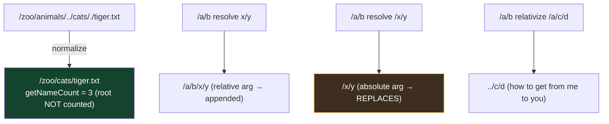

# Module 09 — I/O, NIO.2 & the new java.lang.IO

## 1. java.io class zoo (memorize the naming logic)
- Byte streams: `InputStream/OutputStream` → `FileInputStream, BufferedInputStream, ObjectInputStream, PrintStream`.
- Char streams: `Reader/Writer` → `FileReader, BufferedReader, FileWriter, BufferedWriter, PrintWriter`.
- Bridges: `InputStreamReader`, `OutputStreamWriter` (bytes ↔ chars).
- Wrapping rule: high-level constructors take the same "direction & kind": `new BufferedReader(new FileReader(f))`.
- `BufferedReader.readLine()` → null at EOF (line WITHOUT the terminator); `read()` → −1 at EOF.
- **New in Java 25:** `Reader.readAllLines()` → `List<String>` and `Reader.readAllAsString()` — read-everything convenience (and `Reader.of(CharSequence)`).
- `mark(limit)/reset()` if `markSupported()`.
- `PrintWriter/PrintStream` never throw IOException (checkError()).

## 2. java.lang.IO (Java 25 — JEP 512) ⭐
Simple console I/O, part of `java.lang`... but NOT auto-imported like String — it's implicitly imported only in COMPACT source files:
```java
IO.println("hi");  IO.print("no newline");  String name = IO.readln("Name? ");  IO.readln();
```
In a normal class you write `java.lang.IO.println(...)` or import it. Uses System.out/in under the hood.

## 3. NIO.2 — Path & Files
- `Path p = Path.of("a", "b", "c.txt")` (or Paths.get). Path is an interface; immutable.
- Path methods (NO disk access): `getFileName, getParent, getRoot, getName(i)` (0 = first element AFTER root; root not counted!), `getNameCount` (root not counted; `Path.of("/")` → 0), `subpath(begin, endExcl)` (no root), `resolve` (⚠️ absolute argument REPLACES: `p1.resolve(absP2)` → absP2), `relativize` (both absolute or both relative, else 💥 IllegalArgumentException), `normalize` (removes `.` and dir/`..`), `toAbsolutePath`.
- Files methods (DISK access, most throw IOException): `exists, isDirectory, isRegularFile, createFile, createDirectory` (parent must exist) vs `createDirectories`, `copy` (💥 FileAlreadyExistsException unless REPLACE_EXISTING; copying a directory = shallow/empty), `move` (ATOMIC_MOVE option), `delete` (💥 NoSuchFileException) vs `deleteIfExists`, `readAllLines` → List, `lines()` → lazy Stream (close it! try-with-resources), `readString, writeString, write, size, getLastModifiedTime`.
- Tree ops: `Files.walk(path, maxDepth)` (depth-first stream), `find(path, depth, BiPredicate)`, `list(dir)` (one level). Walk does NOT follow symlinks by default (FOLLOW_LINKS option; cycle 💥 FileSystemLoopException).
- Attributes: `Files.readAttributes(p, BasicFileAttributes.class)`.

## 4. Serialization
- Class implements `Serializable` (marker). `transient` and `static` fields NOT serialized (transient → default values on read).
- Every non-serializable, non-transient field 💥 `NotSerializableException` at runtime.
- `serialVersionUID` recommended. On deserialization: constructors of the serializable class DO NOT run; the first NON-serializable superclass's no-arg constructor DOES run.
- `ObjectOutputStream.writeObject / ObjectInputStream.readObject` (readObject declared to throw IOException & ClassNotFoundException). Records serialize via canonical constructor (validation runs!).

## ⚠️ Top traps
1. `getNameCount` / `getName(0)` exclude the root (`/`).
2. `resolve` with an absolute path argument ignores the receiver.
3. `relativize` mixing absolute + relative 💥.
4. `Files.lines()` must be closed (it holds the file open).
5. transient int → 0 after deserialization, constructors skipped.
6. Path methods never touch disk; Files methods do (and throw IOException — checked!).

---

## 🧠 Visual — Path algebra at a glance



And the stream/eager split: `Files.readAllLines` → whole `List` in memory (heap!) vs `Files.lines` → lazy Stream over the file — must be closed (try-with-resources) or the file handle leaks.
