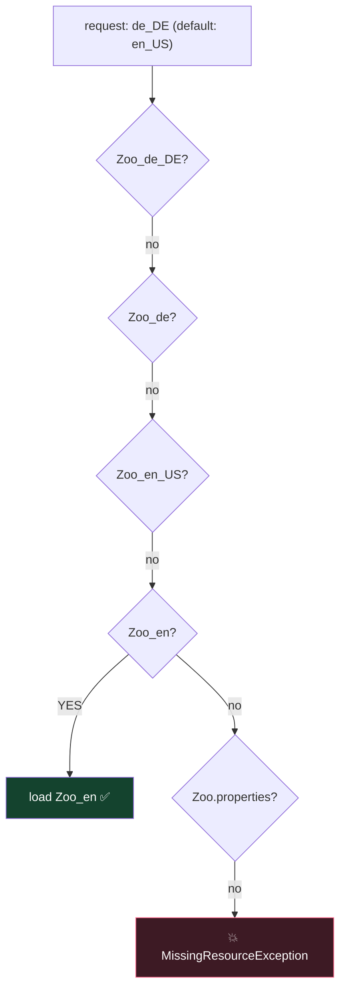

# Module 10 — JPMS Modules & Localization

## PART A — Java Platform Module System

## 1. module-info.java (at module root)
```java
module com.javaboy.store {
    requires java.sql;                    // dependency (java.base implicit, never needed)
    requires transitive com.javaboy.api;  // my readers get this too
    requires static com.javaboy.dev;      // compile-time only
    exports com.javaboy.store.model;              // public API (package!)
    exports com.javaboy.store.spi to com.friend;  // qualified export
    opens com.javaboy.store.entity;               // reflection access (frameworks)
    opens com.javaboy.store.dto to com.mapper;
    uses com.javaboy.api.PaymentService;          // I consume a service
    provides com.javaboy.api.PaymentService with com.javaboy.store.PayPalImpl;
}
```
- `open module X { }` → whole module open for reflection (then no `opens` inside allowed).
- exports/opens take PACKAGES; requires takes MODULES.
- Non-exported packages are invisible to other modules even if public.

## 2. Module types
- **Named** (has module-info) · **Automatic** (plain JAR on module path — name derived from JAR name or `Automatic-Module-Name` manifest entry; exports everything, requires nothing explicitly, can read unnamed module) · **Unnamed** (classpath code — reads everything, no one can `requires` it).

## 3. Commands
```
javac -d out --module-source-path src -m com.javaboy.store
java  --module-path out -m com.javaboy.store/com.javaboy.store.Main
java  -p out -m mod/MainClass                # short forms
jar --create --file store.jar -C out/com.javaboy.store .
jdeps store.jar          # dependency analysis
jmod / jlink             # custom runtime images (jlink can now link WITHOUT jmods — Java 24)
java --describe-module java.sql
java --list-modules
```

## 4. Module Import Declarations (Java 25 — JEP 511) ⭐
```java
import module java.base;     // imports ALL packages exported by java.base
import module java.sql;
```
- On-demand import of every package the module exports (incl. transitively required modules' exports re-exported via `requires transitive`).
- Ambiguities (e.g. `java.util.Date` vs `java.sql.Date` when importing both modules) must be resolved with a specific single-type import — which always wins.
- Usable in ANY source file (not just compact ones). Compact source files implicitly `import module java.base`.

## PART B — Localization

## 5. Locale
- `Locale.of("fr", "TN")` (Java 19+ factory — constructors deprecated), `Locale.FRANCE` (fr_FR) vs `Locale.FRENCH` (fr), `Locale.getDefault()`, `setDefault`.
- Format: language lowercase, COUNTRY uppercase: `fr_TN`. `new Locale.Builder().setLanguage("fr").setRegion("TN").build()`.

## 6. ResourceBundle
Files: `Msg.properties` (default), `Msg_fr.properties`, `Msg_fr_TN.properties`.
`ResourceBundle.getBundle("Msg", locale)` search order:
1. Msg_fr_TN → 2. Msg_fr → 3. Msg_<defaultLocale variants> → 4. Msg.properties → 💥 MissingResourceException.
- Once a bundle is chosen, individual KEY lookup falls back up the parent chain (Msg_fr_TN → Msg_fr → Msg). Missing key 💥 MissingResourceException.
- `bundle.getString("key")`; properties format `key=value` (also `:` or space).

## 7. Formatting
- Numbers: `NumberFormat.getInstance(loc), getCurrencyInstance(loc), getPercentInstance(loc)`, `getCompactNumberInstance(loc, Style.SHORT)` → "7K" / LONG → "7 thousand" (rounds down/truncates to 3 significant digits... know it truncates).
- `DecimalFormat("#,##0.0#")` — `#` optional digit, `0` forced digit.
- `parse` returns Number and throws checked ParseException; parses the leading numeric part ("12abc" → 12).
- Dates: `DateTimeFormatter.ofLocalizedDate(FormatStyle.SHORT/MEDIUM/LONG/FULL).withLocale(loc)`; custom patterns `ofPattern("dd MMM yyyy", loc)`.
- `MessageFormat.format("Hello {0}, you have {1} items", name, n)`.
- Locale.Category: `setDefault(Category.DISPLAY, loc)` vs `Category.FORMAT` — display language vs formatting rules.

## ⚠️ Top traps
1. `exports` a package that doesn't exist / requires a package → compile error (requires = modules!).
2. Bundle search: default locale is tried BEFORE the base Msg.properties.
3. `Locale.of("FR", "tn")` — wrong case doesn't fail, but constants/format questions expect `fr_TN`.
4. NumberFormat.parse throws CHECKED ParseException.
5. Cyclic `requires` → compile error. `requires transitive` vs plain requires readability questions.
6. Module import ambiguity needs explicit single-type import.

---

## 🧠 Visual — module graph & bundle fallback

```mermaid
flowchart LR
    APP["module zoo.app<br/>requires zoo.data;"] --> DATA["module zoo.data<br/>exports zoo.data.api;<br/>requires transitive java.sql;"]
    DATA --> SQL["java.sql"]
    APP -.can use java.sql too<br/>thanks to TRANSITIVE.-> SQL
    style APP fill:#1e3a5f,stroke:#4da3ff,color:#fff
    style DATA fill:#14432e,stroke:#37c871,color:#fff
```



Requested locale first, then the DEFAULT locale, then the base file — the default locale beats the base file. Once found, individual KEYS may still fall back up that bundle's parent chain.

---

## 🧭 The mental model — two systems that both answer "who can see what"

This module bolts together two topics that share one theme: **making access explicit instead of accidental.**

**Modules** answer it for code. Before JPMS, `public` meant "visible to the entire classpath" — you could not have a type that was public for your own use but hidden from consumers. A module declares:

- `requires X` — *I need X.* (`transitive` = and so does anyone who needs me. `static` = at compile time only.)
- `exports P` — *others may use package P at compile time and runtime.*
- `opens P` — *others may reflect deeply into P at runtime.* A different, stronger, narrower grant.
- `uses` / `provides ... with` — service discovery without a compile-time dependency.

**Localization** answers it for text. Never concatenate user-facing strings; look them up by key, and let the bundle chain decide which translation applies.

> **`requires` is what I need, `exports` is what you may call, `opens` is what you may reflect on.** Three different questions, three different keywords.

## 🔬 Worked trace — bundle resolution, step by step

Files present: `Msg.properties`, `Msg_fr.properties`, `Msg_fr_CA.properties`.
Default locale: `en_US`. Request: `Locale.of("fr", "FR")`, key `greeting`.

| Step | Candidate | Outcome |
|---|---|---|
| 1 | `Msg_fr_FR` | does not exist — continue |
| 2 | `Msg_fr` | **found.** This becomes the bundle |
| 3 | key lookup in `Msg_fr` | if present, done |
| 4 | parent `Msg` | consulted only if the key is missing above |
| 5 | still missing | `MissingResourceException` |

Two facts the exam leans on:

- **`Msg_fr_CA` is never consulted.** Canada is not France; the chain narrows by stripping components, it does not search sideways.
- **The bundle chain and the key chain are different searches.** Java first picks the most specific *bundle*, then walks *up its parents* looking for the key. A bundle only needs to contain what it overrides.

## 🔬 Worked trace — `exports` versus `opens`

```java
module com.app {
    exports com.app.api;      // compile + runtime access to public types
    opens   com.app.model;    // deep reflection at runtime, no compile access
}
```

| Attempt | `com.app.api` | `com.app.model` |
|---|---|---|
| `new ApiType()` from another module | ✔ | ✘ not exported |
| `Class.forName("com.app.model.User")` | ✔ | ✔ |
| `field.setAccessible(true)` on a private field | ✘ | ✔ |

`opens` is what serialization libraries and dependency-injection frameworks need. It is deliberately *not* implied by `exports`, because letting anyone reflect into your internals is a much larger promise than letting them call your API.

## 🔬 Worked trace — pattern letters that look alike

```java
LocalDateTime t = LocalDateTime.of(2026, 7, 26, 14, 5, 9);

"yyyy-MM-dd"      → 2026-07-26      // M = month
"yyyy-mm-dd"      → 2026-05-26      // m = MINUTE. silently wrong
"HH:mm:ss"        → 14:05:09        // H = 24-hour
"hh:mm:ss"        → 02:05:09        // h = 12-hour, no am/pm marker
```

Nothing throws. You get a plausible-looking wrong answer, which is exactly why it makes a good exam question. `M` month, `m` minute, `s` second, `S` fraction, `H` 24-hour, `h` 12-hour, `d` day-of-month, `D` day-of-year.

Applying a *time* pattern to a `LocalDate` **does** throw — `UnsupportedTemporalTypeException` — because the field genuinely does not exist.

## 🎭 Why the wrong answer looks right

| Tempting belief | Why it's tempting | The truth |
|---|---|---|
| "`exports` lets frameworks reflect into my package" | It grants access | Only `opens` permits deep reflection. Different grant |
| "`requires` is inherited by my consumers" | Dependencies usually cascade | Only `requires transitive` is passed on |
| "`requires static` means a static import" | The keyword is overloaded elsewhere | Compile-time-only dependency, optional at runtime |
| "A missing key returns null" | Map-like APIs do | `getString` throws `MissingResourceException` |
| "`Msg_fr_CA` might answer a `fr_FR` request" | Both are French | Never. The chain strips components; it doesn't search siblings |
| "`new Locale("fr","FR")` is current practice" | It's in every old tutorial | Deprecated in Java 19. Use `Locale.of` or `Locale.Builder` |
| "A plain JAR can't go on the module path" | It has no module-info | It becomes an **automatic module** — reads everything, exports everything |
| "Module names may contain hyphens" | Artifact names do | Dot-separated Java identifiers only |
| "`mm` means month" | `MM` does | `m` is minute. Silently produces a wrong date |

## 🔁 Recall ladder

1. Three directives that control visibility, and the exact question each answers.
2. What does `requires transitive` change for a consumer of your module?
3. What does `requires static` mean at compile time and at runtime?
4. Walk the bundle search for `fr_FR` given `Msg`, `Msg_fr`, `Msg_fr_CA`.
5. Why is a key missing from `Msg_fr` not automatically an error?
6. Which directive pair wires a `ServiceLoader`, and which side declares which?
7. What is an automatic module and what does it read and export?
8. `M`, `m`, `H`, `h`, `s`, `S` — one meaning each.
9. Which formatting mistakes throw, and which silently produce a wrong string?
10. Name the modern replacement for the `Locale` constructors.
