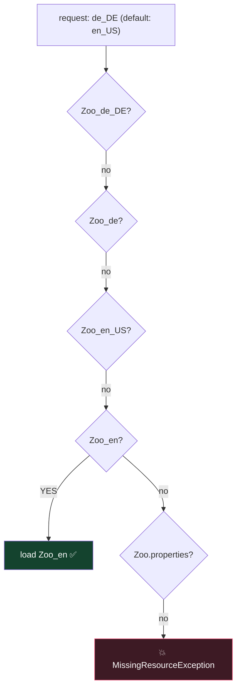

# Module 10 — JPMS Modules & Localization

## PART A — Java Platform Module System

## 1. module-info.java (at module root)
```java
module com.javaboy.store {
    requires java.sql;                    // dependency (java.base implicit, never needed)
    requires transitive com.javaboy.api;  // my readers get this too
    requires static com.javaboy.dev;      // compile-time only
    exports com.javaboy.store.model;              // public API (package!)
    exports com.javaboy.store.spi to com.friend;  // qualified export
    opens com.javaboy.store.entity;               // reflection access (frameworks)
    opens com.javaboy.store.dto to com.mapper;
    uses com.javaboy.api.PaymentService;          // I consume a service
    provides com.javaboy.api.PaymentService with com.javaboy.store.PayPalImpl;
}
```
- `open module X { }` → whole module open for reflection (then no `opens` inside allowed).
- exports/opens take PACKAGES; requires takes MODULES.
- Non-exported packages are invisible to other modules even if public.

## 2. Module types
- **Named** (has module-info) · **Automatic** (plain JAR on module path — name derived from JAR name or `Automatic-Module-Name` manifest entry; exports everything, requires nothing explicitly, can read unnamed module) · **Unnamed** (classpath code — reads everything, no one can `requires` it).

## 3. Commands
```
javac -d out --module-source-path src -m com.javaboy.store
java  --module-path out -m com.javaboy.store/com.javaboy.store.Main
java  -p out -m mod/MainClass                # short forms
jar --create --file store.jar -C out/com.javaboy.store .
jdeps store.jar          # dependency analysis
jmod / jlink             # custom runtime images (jlink can now link WITHOUT jmods — Java 24)
java --describe-module java.sql
java --list-modules
```

## 4. Module Import Declarations (Java 25 — JEP 511) ⭐
```java
import module java.base;     // imports ALL packages exported by java.base
import module java.sql;
```
- On-demand import of every package the module exports (incl. transitively required modules' exports re-exported via `requires transitive`).
- Ambiguities (e.g. `java.util.Date` vs `java.sql.Date` when importing both modules) must be resolved with a specific single-type import — which always wins.
- Usable in ANY source file (not just compact ones). Compact source files implicitly `import module java.base`.

## PART B — Localization

## 5. Locale
- `Locale.of("fr", "TN")` (Java 19+ factory — constructors deprecated), `Locale.FRANCE` (fr_FR) vs `Locale.FRENCH` (fr), `Locale.getDefault()`, `setDefault`.
- Format: language lowercase, COUNTRY uppercase: `fr_TN`. `new Locale.Builder().setLanguage("fr").setRegion("TN").build()`.

## 6. ResourceBundle
Files: `Msg.properties` (default), `Msg_fr.properties`, `Msg_fr_TN.properties`.
`ResourceBundle.getBundle("Msg", locale)` search order:
1. Msg_fr_TN → 2. Msg_fr → 3. Msg_<defaultLocale variants> → 4. Msg.properties → 💥 MissingResourceException.
- Once a bundle is chosen, individual KEY lookup falls back up the parent chain (Msg_fr_TN → Msg_fr → Msg). Missing key 💥 MissingResourceException.
- `bundle.getString("key")`; properties format `key=value` (also `:` or space).

## 7. Formatting
- Numbers: `NumberFormat.getInstance(loc), getCurrencyInstance(loc), getPercentInstance(loc)`, `getCompactNumberInstance(loc, Style.SHORT)` → "7K" / LONG → "7 thousand" (rounds down/truncates to 3 significant digits... know it truncates).
- `DecimalFormat("#,##0.0#")` — `#` optional digit, `0` forced digit.
- `parse` returns Number and throws checked ParseException; parses the leading numeric part ("12abc" → 12).
- Dates: `DateTimeFormatter.ofLocalizedDate(FormatStyle.SHORT/MEDIUM/LONG/FULL).withLocale(loc)`; custom patterns `ofPattern("dd MMM yyyy", loc)`.
- `MessageFormat.format("Hello {0}, you have {1} items", name, n)`.
- Locale.Category: `setDefault(Category.DISPLAY, loc)` vs `Category.FORMAT` — display language vs formatting rules.

## ⚠️ Top traps
1. `exports` a package that doesn't exist / requires a package → compile error (requires = modules!).
2. Bundle search: default locale is tried BEFORE the base Msg.properties.
3. `Locale.of("FR", "tn")` — wrong case doesn't fail, but constants/format questions expect `fr_TN`.
4. NumberFormat.parse throws CHECKED ParseException.
5. Cyclic `requires` → compile error. `requires transitive` vs plain requires readability questions.
6. Module import ambiguity needs explicit single-type import.

---

## 🧠 Visual — module graph & bundle fallback

```mermaid
flowchart LR
    APP["module zoo.app<br/>requires zoo.data;"] --> DATA["module zoo.data<br/>exports zoo.data.api;<br/>requires transitive java.sql;"]
    DATA --> SQL["java.sql"]
    APP -.can use java.sql too<br/>thanks to TRANSITIVE.-> SQL
    style APP fill:#1e3a5f,stroke:#4da3ff,color:#fff
    style DATA fill:#14432e,stroke:#37c871,color:#fff
```



Requested locale first, then the DEFAULT locale, then the base file — the default locale beats the base file. Once found, individual KEYS may still fall back up that bundle's parent chain.
