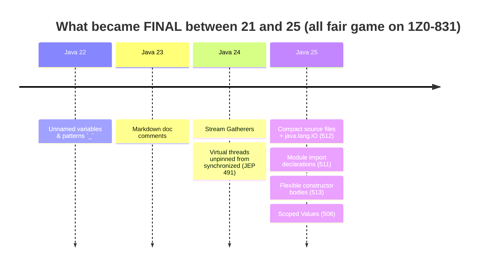
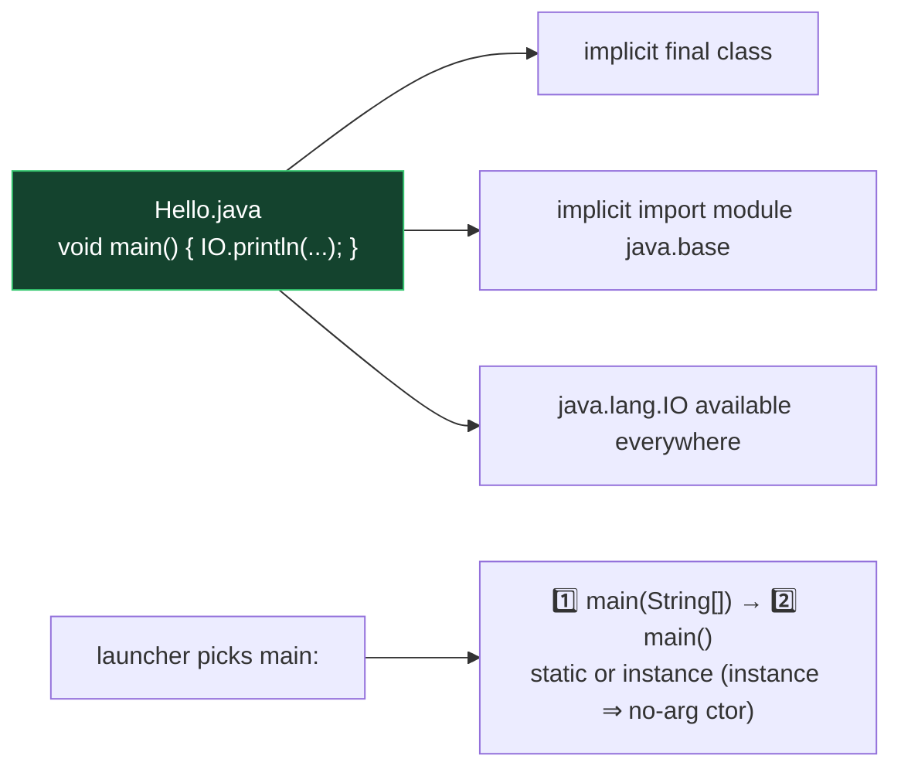

# Module 11 — Everything New Since Java 21 (the OCP 25 delta)

> This module is your **last-week revision weapon**: all Java 22→25 exam-relevant features in one place. Each also appears in context in its home module.

## 1. Compact Source Files & Instance Main (JEP 512 — final in 25)
```java
// HelloCompact.java — the WHOLE file:
void main() {
    IO.println("Hello, " + IO.readln("name? "));
}
```
Rules:
- No class declaration needed — the compiler wraps it in an implicit final class.
- **`main` must return `void`.** It may be `static` or an instance method, and may take `String[] args` or no parameters at all. That gives four legal shapes: `static void main(String[])`, `static void main()`, `void main(String[])`, `void main()`.
- **Selection order** when more than one candidate exists: a method taking `String[]` is preferred over the no-arg form, and `static` is preferred over instance. If an instance `main` is selected, the class must have a non-private no-arg constructor — the launcher instantiates it first.
- Implicit class can't be referenced by name, lives in the unnamed package, can have fields & other methods.
- Implicitly imports `java.lang.IO`'s static methods conceptually available as `IO.println/print/readln` AND implicitly `import module java.base` (so List, Map, Files… work without imports!).
- Run directly: `java Hello.java`.

## 2. java.lang.IO (part of JEP 512)
`IO.println(obj)`, `IO.println()`, `IO.print(obj)`, `IO.readln(prompt)`, `IO.readln()`. In normal (non-compact) classes: fully qualify or import; it's in java.lang but only its STATIC METHODS need the class prefix `IO.` anyway.

## 3. Module Import Declarations (JEP 511 — final in 25)
`import module java.base;` — see Module 10. Works in any file; ambiguities resolved by single-type imports.

## 4. Flexible Constructor Bodies (JEP 513 — final in 25)
Prologue statements before `super()`/`this()`: validate args, compute, assign OWN fields; no `this` usage, no return. See Module 03.

## 5. Scoped Values (JEP 506 — final in 25)
`ScopedValue.newInstance()`, `ScopedValue.where(K, v).run/call(...)`, `get, isBound, orElse`. Immutable, dynamically scoped, ThreadLocal replacement. See Module 08.

## 6. Unnamed Variables & Patterns `_` (JEP 456 — Java 22)
Discard in: catch params, lambda params, for-each vars, record pattern components, local `var _ = ...`, try-with-resources. Never readable; reusable in same scope.

## 7. Stream Gatherers (JEP 485 — Java 24)
`stream.gather(...)` + `Gatherers.windowFixed / windowSliding / fold / scan / mapConcurrent`. See Module 07.

## 8. Virtual threads unpinned from synchronized (JEP 491 — Java 24)
`synchronized` no longer pins virtual threads to carriers. Old workaround (ReentrantLock everywhere) obsolete.

## 9. Smaller API additions worth a flashcard
- Java 23: `Instant.until(Instant)` → Duration; `Console` locale-aware `format(Locale, ...)` methods.
- Java 25: `Reader.readAllLines()`, `Reader.readAllAsString()`, `Reader.of(CharSequence)`; CompletableFuture updates.
- Markdown doc comments `///` (JEP 467, Java 23) — javadoc can be written in Markdown.
- jlink can produce runtime images without jmod files (Java 24).

## 10. Know-they-exist (unlikely deep questions)
- Structured Concurrency — still PREVIEW in 25 (StructuredTaskScope) → not core exam material, but recognize the name.
- Primitive types in patterns — preview. Stable Values — preview. Compact object headers (JEP 519, perf).
- Generational Shenandoah/ZGC, AOT caching — JVM-level, not language exam material.

## ⚠️ Delta traps
1. Compact file: `IO.println` works without import; in a regular class file, `IO` still resolves (java.lang!) — but `readln` etc. are static methods of IO, always called as `IO.x()`.
2. `import module` brings AMBIGUITY (two Dates) → needs single-type import.
3. Prologue: assigning own field ✅, reading it ❌.
4. scan vs fold element counts.
5. ScopedValue has NO set() — attempts don't compile.
6. `_` cannot be used as an identifier expression (`IO.println(_)` ❌).

---

## 🧠 Visual — the Java 21 → 25 exam delta timeline



**One diagram to rule the compact file:**



---

## 🧭 The mental model — Java 25 removed ceremony, not rules

Every delta feature between 21 and 25 does one of two things: **removes ceremony that was never load-bearing**, or **closes a hole the language had left open**. Sorting them that way makes the list memorable instead of arbitrary.

**Removed ceremony** — the code does the same thing with less of it:

- Compact source files and instance `main` — the class wrapper was never telling you anything.
- `java.lang.IO` — `System.out.println` is three lookups to print a line.
- `import module java.base` — twenty import lines that never vary.
- Unnamed variables `_` — naming a thing you promise not to use is noise.
- Markdown doc comments `///` — HTML in comments was an accident of 1997.

**Closed holes** — things that were genuinely impossible before:

- Flexible constructor bodies: you could not validate an argument before `super()` ran.
- Scoped values: `ThreadLocal` was mutable and leaked; there was no immutable, bounded-lifetime equivalent.
- Stream gatherers: you could write custom *terminal* operations with `Collector`, but not custom *intermediate* ones.
- Virtual threads unpinned (JEP 491): `synchronized` used to pin a virtual thread to its carrier, so the advice was to rewrite it as `ReentrantLock`.

> **Ceremony removed, or a hole closed.** Put each feature in one bucket and the delta stops being a list to memorise.

## 🔬 Worked trace — what the compiler does to a compact file

You write:

```java
void main() {
    var names = List.of("a", "b");
    IO.println(names.size());
}
```

The compiler treats it as roughly:

```java
import module java.base;                  // implicit
final class <unnamed> {                   // implicit, unnameable
    void main() {                         // instance method
        var names = List.of("a", "b");
        java.lang.IO.println(names.size());
    }
}
```

Three consequences the exam tests:

1. `List` needs no import — `java.util` is exported by `java.base`.
2. The class has **no usable name**, so no other file can refer to it.
3. Since `main` is an instance method, the launcher instantiates the class first — which requires a non-private no-arg constructor. The implicit one qualifies.

**Selection order** when several candidates exist: a `main` taking `String[]` beats a no-arg one, and `static` beats instance.

## 🔬 Worked trace — the constructor prologue

```java
class Positive extends Number {
    private final int v;

    Positive(int v) {
        if (v <= 0) throw new IllegalArgumentException("must be positive");  // ① prologue
        this.v = v;                                                          // ② own field: allowed
        super();                                                             // ③ superclass runs LAST
    }
}
```

| Allowed in the prologue | Forbidden in the prologue |
|---|---|
| Validating parameters and throwing | Reading `this` or any inherited field |
| Assigning **this class's own** fields | Calling an instance method |
| Local variables, static calls | Passing `this` to anything |

The payoff: `new Positive(-1)` throws **before** the superclass constructor executes at all. Previously the only options were validating inside the `super(...)` argument list — awkward — or after construction, by which point a partially built object already existed.

## 🔬 Worked trace — gatherers versus everything else

```java
var in = Stream.of(1, 2, 3);

in.reduce(0, Integer::sum);                                      // 6      TERMINAL
Stream.of(1,2,3).gather(Gatherers.fold(() -> 0, Integer::sum));  // [6]    INTERMEDIATE
Stream.of(1,2,3).gather(Gatherers.scan(() -> 0, Integer::sum));  // [1,3,6] INTERMEDIATE
```

`reduce` ends the pipeline and hands you a value. `fold` produces a one-element **stream** you can keep chaining from. `scan` emits a running total per input.

The five built-ins worth knowing cold:

| Gatherer | Effect on element count |
|---|---|
| `windowFixed(n)` | groups of n, final window may be partial |
| `windowSliding(n)` | overlapping windows, count − n + 1 of them |
| `fold(seed, fn)` | collapses to exactly **one** |
| `scan(seed, fn)` | one output per input |
| `mapConcurrent(n, fn)` | same count, mapped on virtual threads, order preserved |

## 🎭 Why the wrong answer looks right

| Tempting belief | Why it's tempting | The truth |
|---|---|---|
| "Compact files still need an import for `List`" | Every other file does | `import module java.base` is implicit |
| "A compact file's class can be referenced elsewhere" | It's a real class | It has no usable name — deliberately |
| "`main` may return `int`" | C does it | Must be `void`. Static or instance, `String[]` or no args |
| "`_` can be used anywhere" | It's just an identifier | Locals with initialisers, enhanced-for, try-with-resources, catch, lambda params, patterns. **Not** fields or ordinary method parameters |
| "`_` can be read back" | It's a variable | Reading it is a compile error. That's the point |
| "You may read `this` before `super()`" | You're inside the constructor | Forbidden — the object isn't initialised. Own-field assignment is allowed |
| "`gather` is terminal like `collect`" | They pair up conceptually | **Intermediate.** You can keep chaining |
| "Structured concurrency is final in 25" | It's been around a while | Still **preview**. Gatherers, scoped values, compact files, module imports and flexible constructors are final |
| "`synchronized` still pins virtual threads" | It was true and widely written up | Fixed by JEP 491 in Java 24 |
| "Records and sealed types are Java 25 features" | They feel new | Final by Java **21** — baseline, not delta |

## 🔁 Recall ladder

1. Sort every 22→25 feature into "ceremony removed" or "hole closed."
2. What three things does the compiler add to a compact source file?
3. State the `main` selection order and the constructor requirement for an instance `main`.
4. What may and may not appear before `super()`?
5. Name the six legal positions for `_`, and two illegal ones.
6. Why does `ScopedValue` have no setter?
7. `fold` versus `scan` versus `reduce` — element counts and which are terminal.
8. Which gatherer preserves order while running concurrently?
9. Which Java 22–25 features are still preview?
10. What did JEP 491 change, and which piece of common advice did it make obsolete?
