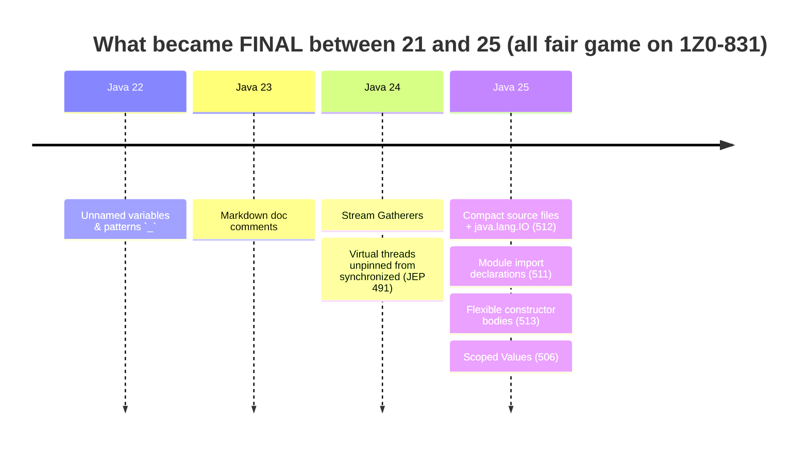
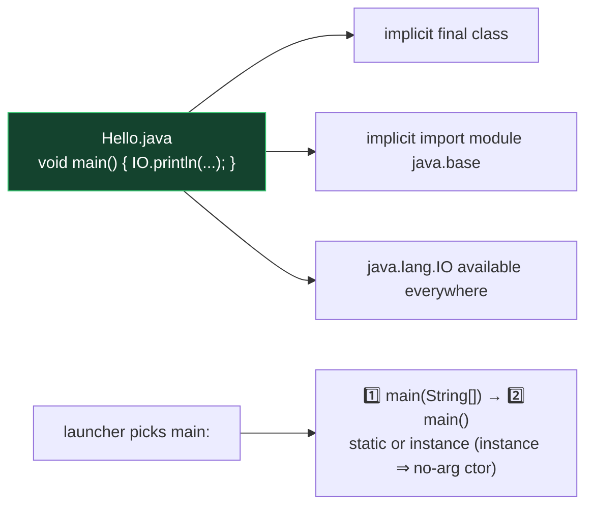

# Module 11 — Everything New Since Java 21 (the OCP 25 delta)

> This module is your **last-week revision weapon**: all Java 22→25 exam-relevant features in one place. Each also appears in context in its home module.

## 1. Compact Source Files & Instance Main (JEP 512 — final in 25)
```java
// HelloCompact.java — the WHOLE file:
void main() {
    IO.println("Hello, " + IO.readln("name? "));
}
```
Rules:
- No class declaration needed — the compiler wraps it in an implicit final class.
- `main` can be: instance method, no args or `String[] args`, any of void/int? → NO: must be void or... exam-safe answer: `void main()` / `void main(String[] args)`, static or instance. Selection priority: `static void main(String[])` → `static void main()` → instance `main(String[])` → instance `main()`.
- Implicit class can't be referenced by name, lives in the unnamed package, can have fields & other methods.
- Implicitly imports `java.lang.IO`'s static methods conceptually available as `IO.println/print/readln` AND implicitly `import module java.base` (so List, Map, Files… work without imports!).
- Run directly: `java Hello.java`.

## 2. java.lang.IO (part of JEP 512)
`IO.println(obj)`, `IO.println()`, `IO.print(obj)`, `IO.readln(prompt)`, `IO.readln()`. In normal (non-compact) classes: fully qualify or import; it's in java.lang but only its STATIC METHODS need the class prefix `IO.` anyway.

## 3. Module Import Declarations (JEP 511 — final in 25)
`import module java.base;` — see Module 10. Works in any file; ambiguities resolved by single-type imports.

## 4. Flexible Constructor Bodies (JEP 513 — final in 25)
Prologue statements before `super()`/`this()`: validate args, compute, assign OWN fields; no `this` usage, no return. See Module 03.

## 5. Scoped Values (JEP 506 — final in 25)
`ScopedValue.newInstance()`, `ScopedValue.where(K, v).run/call(...)`, `get, isBound, orElse`. Immutable, dynamically scoped, ThreadLocal replacement. See Module 08.

## 6. Unnamed Variables & Patterns `_` (JEP 456 — Java 22)
Discard in: catch params, lambda params, for-each vars, record pattern components, local `var _ = ...`, try-with-resources. Never readable; reusable in same scope.

## 7. Stream Gatherers (JEP 485 — Java 24)
`stream.gather(...)` + `Gatherers.windowFixed / windowSliding / fold / scan / mapConcurrent`. See Module 07.

## 8. Virtual threads unpinned from synchronized (JEP 491 — Java 24)
`synchronized` no longer pins virtual threads to carriers. Old workaround (ReentrantLock everywhere) obsolete.

## 9. Smaller API additions worth a flashcard
- Java 23: `Instant.until(Instant)` → Duration; `Console` locale-aware `format(Locale, ...)` methods.
- Java 25: `Reader.readAllLines()`, `Reader.readAllAsString()`, `Reader.of(CharSequence)`; CompletableFuture updates.
- Markdown doc comments `///` (JEP 467, Java 23) — javadoc can be written in Markdown.
- jlink can produce runtime images without jmod files (Java 24).

## 10. Know-they-exist (unlikely deep questions)
- Structured Concurrency — still PREVIEW in 25 (StructuredTaskScope) → not core exam material, but recognize the name.
- Primitive types in patterns — preview. Stable Values — preview. Compact object headers (JEP 519, perf).
- Generational Shenandoah/ZGC, AOT caching — JVM-level, not language exam material.

## ⚠️ Delta traps
1. Compact file: `IO.println` works without import; in a regular class file, `IO` still resolves (java.lang!) — but `readln` etc. are static methods of IO, always called as `IO.x()`.
2. `import module` brings AMBIGUITY (two Dates) → needs single-type import.
3. Prologue: assigning own field ✅, reading it ❌.
4. scan vs fold element counts.
5. ScopedValue has NO set() — attempts don't compile.
6. `_` cannot be used as an identifier expression (`IO.println(_)` ❌).

---

## 🧠 Visual — the Java 21 → 25 exam delta timeline



**One diagram to rule the compact file:**


