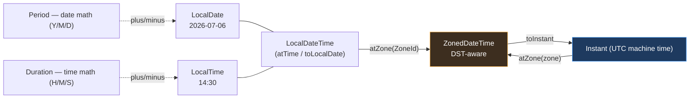

# 🕐 Module 12 — Date-Time API (java.time)

> **by Yassin Ghariani — JavaBoy ☕** · Official objective: *"Manipulate date, time, duration, period, instant and time-zone objects **including daylight saving time**."* The DST questions are the exam's favorite ambush.

## 12.1 The cast of classes (all IMMUTABLE — every method returns a new object)

| Class | Holds | Example |
|---|---|---|
| `LocalDate` | date only | 2026-07-06 |
| `LocalTime` | time only | 14:30:05 |
| `LocalDateTime` | date + time, NO zone | 2026-07-06T14:30 |
| `ZonedDateTime` | date + time + ZONE (DST-aware!) | 2026-07-06T14:30-05:00[America/Chicago] |
| `Instant` | machine timestamp (UTC) | 2026-07-06T19:30:00Z |
| `Duration` | time-based amount (hours/min/sec/nanos) | PT2H30M |
| `Period` | date-based amount (years/months/days) | P1Y2M3D |

- No public constructors — factories: `LocalDate.of(2026, 7, 6)`, `LocalDate.of(2026, Month.JULY, 6)`, `now()`, `parse("2026-07-06")`.
- ⚠️ Months are **1-based** in `of()` (unlike the ancient Calendar). `LocalDate.of(2026, 13, 1)` → `DateTimeException` at runtime.

## 12.2 Immutability — trap #1

```java
var d = LocalDate.of(2026, 1, 31);
d.plusDays(1);
IO.println(d);           // 2026-01-31  ⚠️ result discarded, exactly like String
d = d.plusDays(1);       // 2026-02-01 ✅
```

Chaining evaluates left-to-right: `d.plusMonths(1)` from Jan 31 → **Feb 28/29** (smart truncation, no exception).

## 12.3 Period vs Duration — trap #2

```java
Period p  = Period.of(1, 2, 3);          // 1y 2m 3d  → toString: P1Y2M3D
Duration du = Duration.ofHours(26);      // PT26H (NOT P1DT2H — Duration doesn't normalize to days in toString)
```

- `Period.ofYears(1).ofMonths(2)` ⚠️ these are STATIC factories — the chain result is just `ofMonths(2)` = P2M. Classic trap!
- `Duration` works with time-having types (LocalTime, LocalDateTime, Instant); using Duration units on a `LocalDate` (e.g. `date.plus(Duration.ofDays(1))`) → `UnsupportedTemporalTypeException`. Period on LocalTime → same explosion.
- `LocalTime.of(23,0).plusHours(2)` → wraps to `01:00` silently (no date to carry into).

## 12.4 Time zones & DST — trap #3 (guaranteed on the exam)

US DST (exam's favorite): spring-forward — 2 AM jumps to 3 AM (that day = **23 hours**); fall-back — 2 AM repeats 1 AM–2 AM (that day = **25 hours**).

```java
// Spring forward: 2026-03-08 02:00 doesn't exist in America/New_York
var zdt = ZonedDateTime.of(LocalDate.of(2026, 3, 8), LocalTime.of(1, 30),
                           ZoneId.of("America/New_York"));
var later = zdt.plusHours(1);
IO.println(later.toLocalTime());   // 03:30 — skipped straight over 2:xx
// offset changed -05:00 → -04:00
```

Rules to memorize:
- Nonexistent time (spring gap) → silently shifted forward by the gap.
- Ambiguous time (fall overlap) → the EARLIER offset is chosen; `withLaterOffsetAtOverlap()` opts into the second.
- `Duration.between` = real elapsed machine time (DST-aware with zones); adding `Period.ofDays(1)` keeps the local CLOCK time, adding `Duration.ofHours(24)` keeps the ELAPSED time — across a DST change these differ by an hour!
- `Instant` has no zone, no DST: pure UTC. `zdt.toInstant()`, `instant.atZone(zone)`.
- `ZoneOffset` (fixed, `-05:00`) vs `ZoneId` (rules-aware, `America/New_York`) — only ZoneId knows about DST.

## 12.5 Formatting & parsing

```java
var f = DateTimeFormatter.ofPattern("dd/MM/yyyy HH:mm");
IO.println(LocalDateTime.now().format(f));
var d = LocalDate.parse("06/07/2026", DateTimeFormatter.ofPattern("dd/MM/yyyy"));
```

- Case matters: `M`=month, `m`=minute · `H`=0-23, `h`=1-12 (needs `a` for AM/PM) · `y`=year · `d`=day · `E`=day name · quotes for literal text: `'at'`.
- Formatting a pattern that needs fields the object lacks (e.g. `HH:mm` on a LocalDate) → `UnsupportedTemporalTypeException` at RUNTIME.
- `format` on the formatter or on the temporal — both directions exist: `f.format(d)` ≡ `d.format(f)`.
- Localized: `DateTimeFormatter.ofLocalizedDate(FormatStyle.SHORT/MEDIUM/LONG/FULL)` (LONG/FULL need zone info for times).

## 12.6 Comparisons & conversions

- `isBefore/isAfter/isEqual` for temporal comparison (compareTo works too).
- Epoch bridges: `Instant.ofEpochSecond(...)`, `instant.toEpochMilli()`, `LocalDate.toEpochDay()`.
- `until`: `d1.until(d2)` → Period; `ChronoUnit.DAYS.between(d1, d2)` → long (truncates, doesn't round).
- `TemporalAdjusters`: `d.with(TemporalAdjusters.firstDayOfMonth())`, `next(DayOfWeek.MONDAY)`.

## ⚠️ Trap checklist
1. Discarded result of plus/minus/with (immutability) → value unchanged.
2. `Period.ofX(...).ofY(...)` static-chain → only the LAST call counts.
3. Duration on LocalDate / Period on LocalTime → UnsupportedTemporalTypeException.
4. Month 13 / day 32 → DateTimeException (runtime, not compile).
5. Spring-forward day = 23h; adding Duration vs Period across DST differs by 1h.
6. `mm` vs `MM` in patterns; formatting missing fields → runtime exception.
7. LocalDateTime has NO zone — it can't answer "what instant is this?" without one.

---

## 🧠 Visual — the type map


